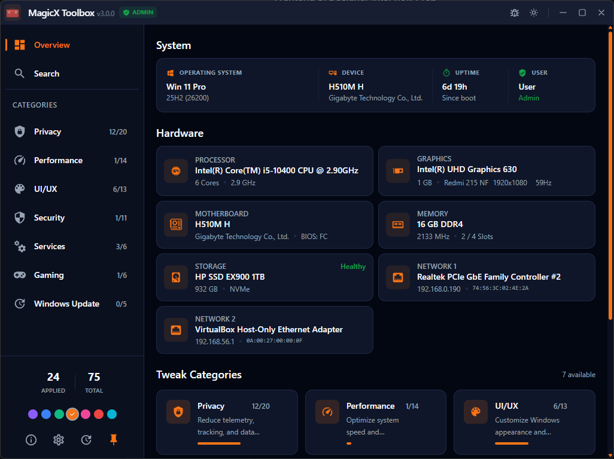
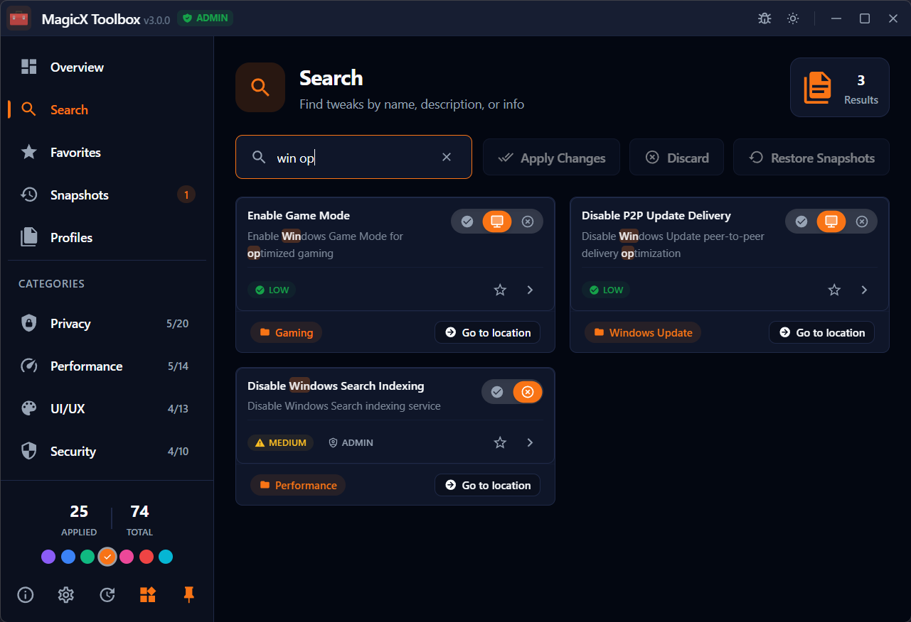
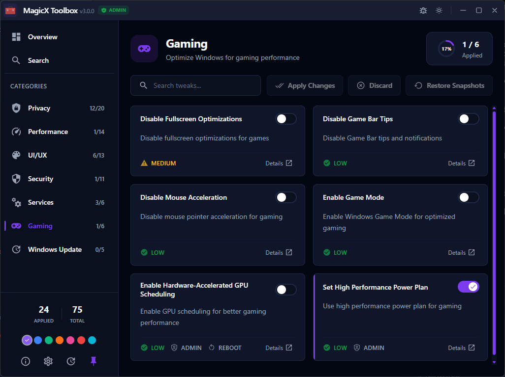

# MagicX Toolbox

**The ultimate tool to optimize, tweak, and customize your Windows experience.**

MagicX Toolbox is a modern, safe, and easy-to-use application designed to help you take control of your Windows PC. Whether you want to boost gaming performance, enhance privacy, remove bloatware, or just customize your system, MagicX Toolbox makes it simple.

## Screenshots

<div align="center">
  
  <p><em>Overview - System information and statistics at a glance</em></p>

  
  <p><em>Search - Find tweaks quickly with fuzzy search</em></p>

  
  <p><em>Gaming Tweaks - Optimize your system for better gaming performance</em></p>
</div>

## Key Features

- **🎮 Gaming Optimization**: Reduce system latency and optimize background processes for a smoother gaming experience.
- **🛡️ Privacy & Security**: Disable invasive telemetry and data collection to keep your personal information private.
- **🚀 Performance Boost**: Remove bloatware and unnecessary services to free up system resources.
- **💾 Safe by Design**:
  - **Automatic Backups**: Snapshots are taken before every change, so you can always undo tweaks.
  - **Risk Levels**: Every tweak is clearly labeled (Safe, Moderate, Advanced) so you know exactly what you're doing.
- **ℹ️ System Information**: Get a detailed overview of your hardware and software specifications.
- **🧹 Bloatware Removal**: Clean up pre-installed junk apps that slow down your computer.
- **Portable**: No installation required. Just extract the files and run the .exe file.

## Download

1. **Download**: Go to the [Releases Page](https://github.com/ehsan18t/magicx-toolbox-gui/releases/latest) and download the latest .exe file.

## How to Use

1. **Browse Categories**: Navigate through tabs like *Gaming*, *Privacy*, and *System* to find tweaks.
2. **Review Tweaks**: Read the description and check the risk level for each tweak.
3. **Apply**: Toggle the switch to apply a tweak. The app will automatically create a restore point.
4. **Revert**: If you change your mind, simply toggle the switch off to revert the change or restore a snapshot from the "Backups" section.

---

## For Developers and Contributors
If you are a developer looking to contribute or build from source, read the section below.

## Development

### Commands

| Command                | Description                                                                           |
| :--------------------- | :------------------------------------------------------------------------------------ |
| `pnpm run dev`          | Starts the Tauri development server with hot-reloading for both frontend and backend. |
| `pnpm run build`        | Builds and bundles the application for production.                                    |
| `pnpm run build:debug`  | Creates a debug build of the application.                                             |
|                        |                                                                                       |
| `pnpm run format`       | Formats all source files with Prettier.                                               |
| `pnpm run format:check` | Checks for formatting errors without modifying files.                                 |
| `pnpm run lint`         | Lints the source files using ESLint.                                                  |
| `pnpm run lint:fix`     | Lints and automatically fixes problems.                                               |
| `pnpm run check`        | Runs the Svelte type-checker.                                                         |
| `pnpm run validate`     | Runs all quality checks: format, lint, and type-check.                                |
|                        |                                                                                       |
| `pnpm run clean`        | Removes all build artifacts and temporary directories.                                |
| `pnpm run prepare`      | SvelteKit's command to generate types                                                 |

### Project Structure

```
├── src/                      # Frontend source
│   ├── lib/
│   │   ├── api/              # Tauri command wrappers
│   │   ├── components/       # Svelte components
│   │   │   ├── ui/           # Reusable UI primitives
│   │   │   └── tweak-details/# Tweak display sub-components
│   │   ├── stores/           # Svelte 5 rune-based stores (.svelte.ts)
│   │   │   ├── index.ts      # Barrel export for all stores
│   │   │   ├── tweaks.svelte.ts # Tweaks system (data, loading, pending, actions)
│   │   │   ├── navigation.svelte.ts # Tab navigation
│   │   │   └── ...           # Theme, modal, sidebar, settings, etc.
│   │   ├── config/           # App configuration
│   │   └── types/            # TypeScript types
│   ├── routes/               # SvelteKit routes
│   └── app.css               # Global styles & CSS variables
├── src-tauri/                # Tauri backend
│   ├── src/
│   │   ├── commands/         # Tauri command handlers
│   │   │   └── tweaks/       # Modular tweak commands (query, apply, batch)
│   │   ├── models/           # Data structures
│   │   └── services/         # Business logic (registry, services, scheduler)
│   └── tweaks/               # YAML tweak definitions
├── static/                   # Static assets
└── README.md
```

## Documentation

### Backend Development

For detailed information about working with the Rust backend:

**📖 [Read the Rust Backend Developer Guide](./docs/RUST_BACKEND_GUIDE.md)**

### Authoring Tweaks (YAML)

Tweaks live in `src-tauri/tweaks/*.yaml`. Each file defines **one category** plus a list of tweaks.

**📖 [Read the Tweak Authoring Guide](./docs/TWEAK_AUTHORING.md)**

### Architecture Overview

For understanding the overall architecture and data flow:

**📖 [Read the Architecture Guide](./docs/ARCHITECTURE.md)**

## Customization

### Theme

Edit `src/app.css` to customize colors and design tokens.

### App Configuration

Update `src/lib/config/app.ts` for app metadata and settings.

### Window Settings
Modify `src-tauri/tauri.conf.json` and `src-tauri/Cargo.toml` for window behavior and permissions.

## License

MIT License - see LICENSE file for details.