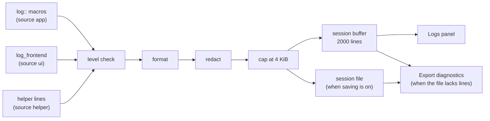

# Logging

The app keeps one on-device log. Every line is redacted as it is recorded, kept in an in-memory session buffer that the Logs panel reads, and, unless the user turns saving off, written to a session file on this PC. Nothing is uploaded; the only way a log leaves the PC is Export diagnostics, which the user starts. The TrustedInstaller helper's lines come back inside its response and join the same log.

Code: `src-tauri/src/logging/` (`mod.rs` the global logger and its control state, `pipeline.rs` the record pipeline, `redact.rs`, `files.rs` the session files, `settings.rs`, `panic.rs`, `collector.rs` the helper's logger and the parent's re-log), `src-tauri/src/commands/logging.rs`, `src-tauri/src/services/elevation/broker.rs`, `src/lib/stores/logs.svelte.ts`, `src/lib/components/layout/LogsPanel.svelte`, `src/lib/components/views/SettingsView.svelte` (Diagnostics), `src/lib/utils/logger.ts`. Related decision: [ADR-0010](../adr/0010-logs-are-local-redacted-at-write-and-opt-out-stops-disk-writes.md).

## The record pipeline

1. **Level check.** Info by default, Debug when Detailed logging is on. A debug build always records Debug. Records from other crates (a target that does not start with `app_lib`) are kept only at Warn and above. Interface and helper lines are pushed in with their source set explicitly, so that filter never judges them by target.
2. **Format.** One line per record: `2026-10-02T14:03:05.123+06:00 INFO  app    app_lib::commands::tweaks: message`, local time with its UTC offset, the level and the source (`app`, `ui` or `helper`) padded, then the target. A multi-line message continues on lines indented with a tab.
3. **Redact.** See [Redaction](#redaction). Formatting and redaction run outside every lock.
4. **Cap.** The input is cut at 8 KiB (twice the record cap) before redaction, so one huge message cannot stall every logging thread. The whole formatted line is then capped at 4 KiB, cut on a character boundary, ending in `… [truncated N bytes]`.
5. **Session buffer.** The last 2000 lines, each with a sequence number that starts at 1 and only grows.
6. **Session file.** Written only when saving is on (see [Session files](#session-files)).

The logger is installed first thing in `run()` and starts memory-only. `setup()` then reads the settings and attaches the session file, copying the buffer so far into it; writers skip every line already copied, so nothing is lost or written twice. A second launch that only brings the running window forward returns before `setup()` and creates no file. A debug build also echoes each line to stderr, for `pnpm tauri dev`; a release build has no console output.

A record raised while the same thread is already inside the logger is dropped, never recursed into. Nothing inside `logging/` calls `log::`; a problem with the logger itself (a write that fails) becomes one line pushed straight into the buffer.

## Redaction

The identity to remove is read once, before the logger is installed:

| Value | Placeholder |
| --- | --- |
| The folder the executable runs from | `<app-dir>` |
| `USERPROFILE` | `%USERPROFILE%` |
| `LOCALAPPDATA` | `%LOCALAPPDATA%` |
| `APPDATA` | `%APPDATA%` |
| `TEMP`, `TMP` | `%TEMP%` |
| `OneDrive`, `OneDriveCommercial`, `OneDriveConsumer` | `%OneDrive%` |
| `USERNAME`, the session account name (with and without its domain) | `<user>` |
| `USERDNSDOMAIN`, and `USERDOMAIN` when it differs from `COMPUTERNAME` | `<domain>` |
| `COMPUTERNAME` | `<computer>` |
| The process token's SID | `<sid>` |
| The MachineGuid | `<machine-guid>` |

- **Paths** match case-insensitively (ASCII folding) in their plain, `\\`-escaped and `/` forms, and only where the next character is not a letter, digit or `_`, so `C:\Users\Tim` leaves `C:\Users\Timothy` alone. Only the matched folder is replaced; the rest of the path stays readable (`%LOCALAPPDATA%\me.ehsankhan.magicx-toolbox\logs`). The longest value wins where two overlap.
- **Names** match only as a whole word, with letters, digits and `_` counting as word characters, so a user called Tim never breaks "Optimize" and a user called app never breaks `app_lib`. Names shorter than 3 characters, and generic ones (administrator, admin, user, users, default, defaultuser0, public, system, guest, owner, test, dev, pc), are never redacted.
- **Email addresses** become `<email>` first, on the raw line, so a name inside one (`smith.alice@contoso.com`) never splits it.
- **Patterns**, checked after the values above and only when a line contains `S-1-`, `users\` or `users/`: other SIDs (`S-1-5-21-…` and `S-1-12-1-…`, with or without the final RID) become `<sid>`, and any other user's profile folder becomes `<profile>`. The profile pattern takes a drive, UNC or `\Device\…` prefix, any run of `\` or `/` separators, and a name that may hold spaces, up to the next separator, quote, line end or any of `:;,()<>|`, so `C:\Users\Bob: Access is denied.` keeps its error text. Folders that name nobody stay as they are: `Public`, `Default`, `All Users`, `Default User`, `DefaultAppPool` and the stoplisted account names. A `//host/users/…` right after a `:` is a URL, not a UNC path, and is kept.
- **Cuts.** Where text is cut before redaction (the 8 KiB input cap, the helper's 512-byte lines, the 2 KiB output tail of a failing script), the cut moves to a separator within 64 bytes, or 64 bytes further, so no fragment of a SID, GUID or path slips past redaction. Whitespace counts as a separator, so the input cap and the script tail also step past the first or last words of a redacted value that holds spaces (an account named `John Smith`, a `OneDrive - Contoso` folder): `John` alone never survives. The helper's 512-byte cut runs in the helper, which has no identity, so it cannot. A PowerShell `_x000D_` escape counts as a word boundary, and a script's CLIXML error output is decoded before it is logged.

Redaction never uses Unicode lowercasing, which changes byte lengths, and never panics: it runs inside the logger. The Manual Tests report uses the same code in a different mode, which replaces each match and the rest of its path with `<redacted>` ([MANUAL_TESTS.md](../MANUAL_TESTS.md)).

## Session files

| Item | Where or what |
| --- | --- |
| Folder | `%LOCALAPPDATA%\me.ehsankhan.magicx-toolbox\logs`. Refused, and the session kept in memory, if it is a link or junction. |
| File | `magicx-YYYYMMDD-HHMMSS-<pid>.log`, one per run, created new, never appended to. |
| Header | App version, Windows build and revision, edition, machine and process architecture, elevated yes or no, pid, the logs folder (redacted), Detailed on or off. |
| Size | Past 2 MiB a marker line is written and only warnings and errors follow; at 4 MiB a final marker is written and the file stops. |
| Retention | The newest 10 files within 10 MiB in total. A file whose process is still running, and the current file, are never deleted; only names that match the pattern exactly are. |

Retention runs whenever a new session file is created, and also at startup when saving is off. Every startup also deletes `magicx-toolbox.log`, `magicx-toolbox_*.log` and `magicx-toolbox*.log.bak` from the same folder: files an older build's log plugin wrote.

A write that fails (disk full, folder gone, access denied) closes the file, records one line in the buffer, and shows "Logging problem: …" in Settings. The app keeps working memory-only and does not retry until saving is turned off and on again or the app restarts.

## Settings

`logging.json` in `%LOCALAPPDATA%\me.ehsankhan.magicx-toolbox` holds `{ "persist": bool, "detailed": bool }`.

- **Missing**: the defaults (saving on, Detailed off). The file is not created until the user changes a setting. A missing field takes its default, and a leading UTF-8 byte order mark (Notepad's "UTF-8 with BOM") is ignored.
- **Unreadable or invalid**: this session runs memory-only, Settings shows the problem, and the file is left as it is until the user changes a setting. A save writes a temporary file beside it and renames it over the old one, so a failed save leaves the old file whole.
- **Applied live.** Turning saving off closes the file (existing files are kept); turning it on opens a new session file and copies the buffer so far into it. Detailed changes the level at once. Settings shows the effective state the backend returns, not the state the switch was moved to.
- **A relaunch** (Restart as administrator, or starting an installed update) passes the effective values as `--log-persist=0|1` and `--log-detailed=0|1`, so the new instance keeps this session's settings, and an elevated instance running under another administrator account follows this user's choice for that session without writing it.

## The TrustedInstaller helper

The broker child installs its own collecting logger. It keeps this crate's records at the level the request names (`detailed`, the parent's own level), never redacts (the parent does), and keeps at most 200 lines of 512 bytes, with control characters replaced by spaces; past 200, the last kept line is replaced by one saying how many were not kept. It never writes a file. Its lines travel back as `log` in the response (`LEVEL target: message`), or, if it panics, in a panic report written to the response path.

The parent re-logs them only after the response passes the version and nonce checks, or, for a child that exited with the panic code, after the panic report passes the same checks (a missing, oversized, unparseable or foreign report is ignored without a line). Each line is cleaned and cut again, at most 200 are taken, and each is pushed under source `helper`, prefixed with the batch number, and redacted by the parent's pipeline. A panic adds one Error line `#n panicked: <message>`. Every response file is read with a 256 KiB cap; a larger one reads as outcome-unknown.

The parent's own lines carry the same number: `TrustedInstaller broker batch #n started: 2 ops`, `… finished: 2 ops in 840 ms`, or `… failed: operation 1 was refused in the child: not found (Windows error 1060 (ERROR_SERVICE_DOES_NOT_EXIST)) after 840 ms`. An op's error text can quote a key, a value or a path, so the child logs it only at Debug: it crosses only when Detailed logging is on, and is redacted like every helper line. The wire format is in [elevation.md](tweak/elevation.md#the-trustedinstaller-broker).

## What is logged

- **Every command at entry**, except `get_log_tail` (the panel polls it) and `log_frontend` (it is itself a log line).
- **Every outcome** of apply, restore, keep-current-state, app removal and app install: Info `apply 'tweak' -> 'Option': <state> in N ms` on success, Warn `… refused: <ERROR_CODE>` when the request is turned away before anything runs (an availability gate, a change already in flight, the app exiting, an unknown id), Warn `… failed: <ERROR_CODE>: <message>` otherwise. Values read from or written to the registry or the hosts file are never logged.
- **Failing scripts.** An action or app script that exits non-zero logs the last 2 KiB of its stderr (or stdout when stderr is empty) at Warn. PowerShell under `-EncodedCommand` writes stderr as CLIXML; it is decoded to plain text first. The raw output of every script is also logged at Debug, within the 4 KiB line cap.
- **Panics** in the main process: message, location and thread name, at Error. A release build aborts right after, so the buffer and the session file are the only record.
- **Interface errors.** `src/lib/utils/logger.ts` forwards uncaught errors and unhandled promise rejections through `log_frontend` (source `ui`, target `webview`). The client drops a message repeated within 5 seconds and sends at most 5 a second; the backend keeps at most 20 a second and reports how many it dropped in one line, written once the second is over (at the next interface message, Logs panel read or export).

## Commands

| Command | Does |
| --- | --- |
| `get_log_tail(since)` | Buffer lines after `since`, and how many were evicted before they could be read (`skipped`). |
| `log_frontend(level, message)` | Records an interface line (error, warn or info). |
| `get_log_settings()` | Saving, Detailed, the logs folder, whether a file is being written, any problem, and the number and total size of the session files. |
| `set_log_settings(persist, detailed)` | Saves and applies the choice, and returns the effective state. |
| `export_diagnostics()` | Opens a save dialog (default `magicx-diagnostics-YYYYMMDD-HHMMSS.txt`) and writes the export; returns the path, or nothing when cancelled. |
| `reveal_last_export()` | Shows the last exported file in Explorer. |
| `open_log_folder()` | Opens the logs folder. |
| `delete_logs()` | Closes the current file, deletes every session file whose process has ended (this one's included), and starts a new file when saving is on. That new file starts empty: earlier lines of this session are not copied back. |

The export starts with a header (creation time, app version, Windows build and revision, edition, architecture, elevated, the account check result, saving and Detailed on or off, any logging problem, the tweaks in Needs Attention and those with snapshot history), then every kept session file oldest first, each after a `===== <file name> =====` line. When saving is off it ends with this session's buffer under `===== this session (not saved to disk) =====`; when saving is on but the file does not hold every line (a write failed, it reached 4 MiB, it could not be opened, or it passed 2 MiB and now takes only warnings and errors), the buffer follows under `===== this session (not fully saved to disk) =====`. The header is redacted; the files already are.

## In the interface

- **Logs panel.** The Logs button (file icon) in the title bar opens it docked at the bottom of the window, under the content (it is part of the root layout, so it also opens from the error screens); Escape closes it and returns focus to the button. It shows this session only ("This session. Earlier sessions: Export or Open folder."), with a Detailed badge when Detailed logging is on. Filters: level (All levels, Info and above, Warnings and errors, Errors only), source (All sources, App, Interface, Helper) and a search box. Buttons: Clear view (empties the view only; saved logs are not changed), Copy visible lines (with a first line naming the app version, Windows build and whether the app is elevated), Export diagnostics, Open logs folder, Close logs. The panel polls about twice a second while it is open and never while it is closed; it keeps the last 2000 lines, and a gap in what it read shows as "N lines skipped".
- **Settings, Diagnostics.** "Save logs on this PC" and "Detailed logging" switches, the logs folder path, the number and size of the saved files, any problem ("Logging problem: …"), and Open logs folder, Export diagnostics and Delete logs (after a "Delete saved logs?" confirmation). With saving off it notes "Existing log files are kept."
- **Export.** On success a toast says "Diagnostics exported. Check the file before sharing." with a Show in folder button; a cancelled dialog shows nothing.

## Traps

- **Never call `log::` inside `logging/`.** The re-entrancy guard drops the record, so the line is silently lost.
- **Never log a value read from the user's registry or files.** Redaction knows the user's paths and names, not their data.
- **Never log the broker command line.** It carries the transport's temporary paths.
- **Session file order is the writer lock's order**, which can differ by a few lines from the buffer's sequence numbers when several threads log at once (ADR-0010).
- **What the helper logged is lost when it is killed** (an antivirus kill, the 30 second timeout) or cannot write its response file: only the parent's exit-code line remains ([known issue 3](../KNOWN_ISSUES.md)).
