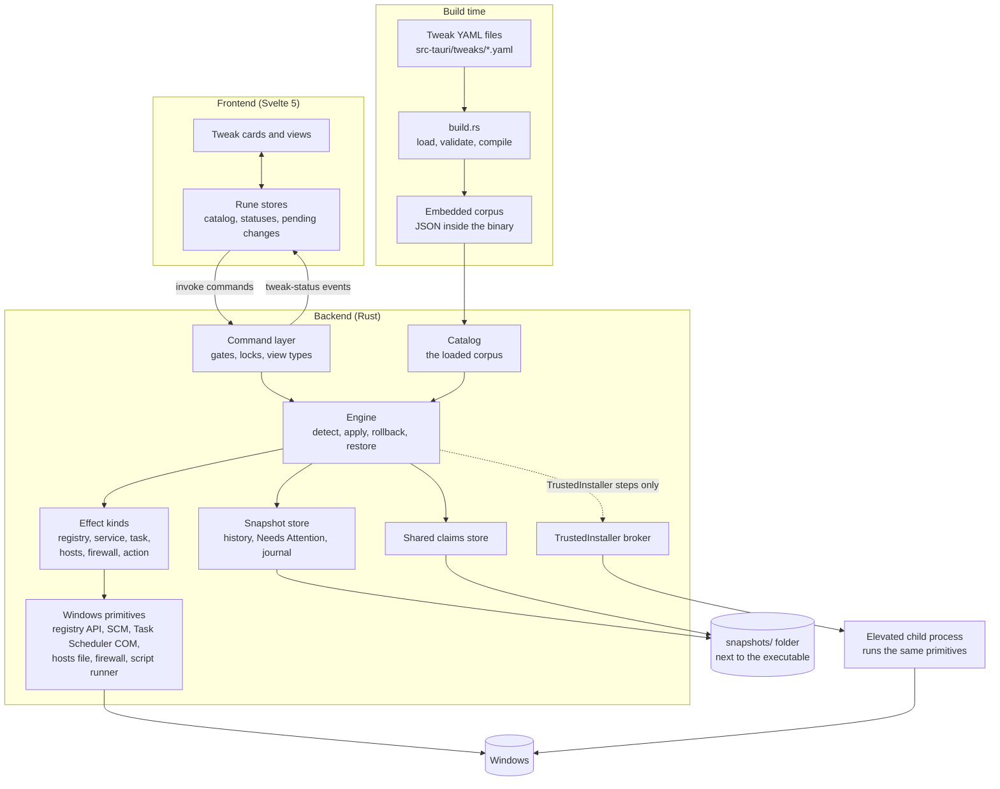

# Tweak System Architecture

The tweak system is the core of MagicX Toolbox. It takes a curated set of Windows changes written in YAML, proves them safe when the app is built, shows the user the live state of every change, applies a chosen option, and records enough history to undo it later. When something goes wrong it says so, rather than leaving the machine in a state the app pretends not to see.

This folder is the architecture reference: what each component is responsible for, how the components talk to each other, and which rules hold the design together. It stays at the component level. For the YAML authoring rules read [TWEAK_AUTHORING.md](../../TWEAK_AUTHORING.md); for what each individual tweak does read the [tweak wiki](../../tweaks/README.md); for the reasoning behind the key decisions read the [ADRs](../../adr/).

## The big picture

Read it top to bottom. At build time the YAML becomes a validated, embedded corpus. At run time the frontend asks the command layer for the catalog and for statuses, and sends apply and restore requests. The command layer gates each request and hands it to the engine. The engine reads and writes Windows through the effect kinds, records history in the snapshot store before it changes anything, keeps shared settings in the claims store, and sends the few steps that need TrustedInstaller rights to a short-lived elevated child process.

## Design principles

These are the ideas every component serves. When a change seems to fight one of them, the change is probably wrong.

1. **One representation per change.** A change is described once, as an effect on the tweak's surface, and one value type serves capture, apply, detection and restore. The four operations cannot disagree about what a value means, because they all use the same one.
2. **Did it work is always answered.** Every operation that touches Windows returns success or a typed error. A failed read is never reported as a harmless value; "not found" and "access denied" stay distinct. A state the app cannot read is shown as Unknown, never guessed.
3. **Mistakes are caught when the app is built.** The validator runs over the whole corpus inside `build.rs`, so an ambiguous option, a forgotten value or two tweaks fighting over one registry value fails the build instead of reaching a user.
4. **Nothing is silently lost.** History is written before the first change. A snapshot entry is only deleted by a verified restore, a verified rollback, a settled duplicate or an explicit user decision. A failure that leaves the machine uncertain is recorded as Needs Attention and shown until it is resolved.
5. **Nothing is silently escalated.** Each tweak declares the privilege it needs. The app never raises its own privilege to get past an access-denied error; the user elevates deliberately.

## Components

| Component | Responsibility | Code | Read more |
| --- | --- | --- | --- |
| Corpus and build pipeline | The tweak model, the YAML schema, build-time validation, embedding, Windows build gating | `src-tauri/build.rs`, `src-tauri/src/tweaks/{model,schema,parse,validate,winver,mod}.rs` | [corpus-and-build.md](corpus-and-build.md) |
| Detection | Works out each tweak's live status from reads; probe cache; the launch scan | `src-tauri/src/tweaks/engine/detect.rs` | [detection.md](detection.md) |
| Apply, rollback and restore | The engine lifecycle that changes the machine and undoes changes | `src-tauri/src/tweaks/engine/{apply,revert,lifecycle,context,mod}.rs` | [apply-and-restore.md](apply-and-restore.md) |
| Effect kinds | Read and drive one kind of Windows setting; run scripts | `src-tauri/src/tweaks/kinds/`, `src-tauri/src/services/` | [effect-kinds.md](effect-kinds.md) |
| Persistence | Snapshot history, Needs Attention records, the action journal, crash recovery, shared claims | `src-tauri/src/tweaks/{snapshot,shared_claims}.rs` | [persistence.md](persistence.md) |
| Elevation | Privilege levels, routing, the over-the-shoulder guard, the TrustedInstaller broker | `src-tauri/src/tweaks/engine/context.rs`, `src-tauri/src/services/elevation/` | [elevation.md](elevation.md) |
| Commands and UI | The Tauri command surface, gates, launch sequence, frontend stores, what each state looks like | `src-tauri/src/commands/tweaks.rs`, `src/lib/stores/tweaks*.svelte.ts`, `src/lib/components/tweaks/` | [commands-and-ui.md](commands-and-ui.md) |
| App items | Removable apps outside the tweak model: presence, Remove, Install, the install route | `src-tauri/src/apps/`, `src-tauri/src/commands/apps.rs`, `src-tauri/src/services/appx_index.rs`, `src/lib/stores/apps.svelte.ts` | [apps.md](apps.md) |

Suggested reading order for someone new: this page, then corpus-and-build, detection, apply-and-restore, persistence, and the rest as needed. App items share the build pipeline, the action runner and the per-id lock, but nothing else; read [apps.md](apps.md) on its own.

## The life of one change

1. **Authoring.** An author adds a tweak to a category YAML file: its surface (the effects it manages) and its options (a value for each effect).
2. **Build.** `build.rs` loads every YAML file, validates the corpus against four Windows milestones, and embeds it as JSON.
3. **Launch.** The frontend loads the catalog, then starts a background scan. The backend detects every tweak in parallel and streams one status event per tweak.
4. **Choosing.** The user picks an option on a card. That only stages the change; nothing happens until they press Apply.
5. **Apply.** The command layer checks the tweak is available and takes its lock. The engine re-detects, captures the current values, writes a snapshot entry, then drives each effect and verifies it by reading it back.
6. **Failure.** If any step fails, the engine rolls back what it did, from the entry it just wrote. If the rollback cannot be verified, the tweak shows Needs Attention and the entry is kept.
7. **Restore.** Later the user presses Restore. The engine walks back to the most recent snapshot entry and, once that is verified, deletes the entry. Pressing Restore again steps one entry further back.

## Vocabulary

| Term | Meaning |
| --- | --- |
| Tweak | One user-facing change, such as "Disable telemetry tasks". Has an id, a risk level, an elevation floor, a surface and options. |
| Category | The group a tweak is listed under. Set once per YAML file. |
| Surface | The list of effects a tweak manages. Every option describes the whole surface. |
| Effect | One unit of change on the surface: a **Setting** (registry value, registry key, service startup type, scheduled task, hosts entry, firewall rule), a **Shared** reference to a shared setting, or an **Action** (a script with optional undo and probe). |
| Option | A named state of the tweak: a value for every effect on its surface. One or two options show as a switch, three or more as a dropdown. |
| Value | The one value type used everywhere: absent, missing, a typed registry value, a service startup type, a task enabled flag, or present/not present. |
| System Default | A computed status, not an option: the live surface matches none of the authored options. It is never authored and never offered as a choice; restoring a value-dump entry can return the tweak to it. |
| Unknown | The status when any part of the surface cannot be read (for example access denied). Often means "elevate to see". |
| Unavailable | The tweak, or one option, has nothing to do on this Windows build or machine. |
| Needs Attention | A per-tweak record that the machine may not be in the state the app expected: after a failed rollback, a failed restore, a crash, or a verified operation whose bookkeeping could not be saved. An unreadable record is shown the same way. |
| Snapshot entry | One return point in a tweak's history. Holds either an **option reference** (the option that was active) or a **value dump** (the raw values of an unauthored state). |
| Journal | The list of actions an apply plans to run, written before they run and marked as each one completes, so a crash is detectable. |
| Shared claim | A reference-counted hold on a setting that several tweaks need with the same value. The first claim saves the original, the last release restores it. |
| Elevation level | `user`, `admin` or `ti` (TrustedInstaller). Declared per tweak, refinable per effect, escalate-only. |
| Milestone | One of the Windows builds the validator proves the corpus against: 19045, 22621, 22631 and 26100. |
| Residue | An action's effect that is still present but that the active option does not run and cannot undo. Shown, not treated as a mismatch. |
| App item | A removable app authored under `apps:`. Has a presence (Installed, Absent, Unknown) and Remove and Install actions; no options, no snapshot (ADR-0009). Not a tweak. |

## Safety decisions

The ADRs record the decisions that hold the system together. Each doc in this folder links the ones it depends on.

| ADR | Decision |
| --- | --- |
| [0001](../../adr/0001-rollback-failure-is-a-first-class-state.md) | A rollback that cannot complete is a first-class Needs Attention state. "Atomic" means attempted atomically, with failure surfaced. |
| [0002](../../adr/0002-snapshot-deletion-requires-verification-or-consent.md) | A snapshot entry is deleted only after verification or with the user's consent, never on a failure path. |
| [0003](../../adr/0003-system-default-is-a-computed-status.md) | System Default is a computed status. Restore Snapshot is the only way back and walks the history. |
| [0004](../../adr/0004-value-null-is-not-a-delete-spelling.md) | `absent` is the only way to spell "delete". A missing or null value is a build error. |
| [0005](../../adr/0005-elevation-is-per-tweak-and-never-silently-escalated.md) | Elevation is declared per tweak, refinable per effect, and never silently escalated. |
| [0006](../../adr/0006-one-address-one-owner-shared-state-is-declared-and-refcounted.md) | Each Windows address has one owner in the corpus. Genuine sharing is a declared, reference-counted claim. |
| [0007](../../adr/0007-option-snapshots-are-references-restore-reapplies-the-current-definition.md) | An option snapshot is a reference. Restore re-applies the option as the current corpus defines it. |
| [0008](../../adr/0008-one-build-line-per-snapshots-folder-downgrades-are-unsupported.md) | One build line per snapshots folder. An older build over a newer folder is unsupported. |
| [0009](../../adr/0009-app-items-are-outside-the-snapshot-model.md) | Removable apps are app items, not tweaks: presence plus Remove and Install, with no snapshot or Restore. |
| [0010](../../adr/0010-logs-are-local-redacted-at-write-and-opt-out-stops-disk-writes.md) | Logs stay on the PC and are redacted before any sink; opting out stops disk writes only; the TrustedInstaller child's log lines return in its response. |

## Related documents

- [TWEAK_AUTHORING.md](../../TWEAK_AUTHORING.md): how to write a tweak, the full YAML schema and every validator rule.
- [Tweak wiki](../../tweaks/README.md): one entry per shipped tweak, with its effects, options, risks and sources.
- [Logging](../logging.md): the on-device logger, redaction, session files, the Logs panel and how the TrustedInstaller child's log lines reach the app.
- [MANUAL_TESTS.md](../../MANUAL_TESTS.md): the test build's on-device checks for behaviour only a real Windows machine can show.
- [KNOWN_ISSUES.md](../../KNOWN_ISSUES.md): confirmed open defects with their diagnosis.
- [TEST_MATRIX.md](../../TEST_MATRIX.md): what CI covers, what it cannot, and the signing plan.

## Keeping this folder current

When a change alters how a component behaves (not just how it is coded), update the matching page here in the same commit. Pages describe the present system only; history belongs in commit messages. Diagrams are Mermaid, so they are edited as text.
