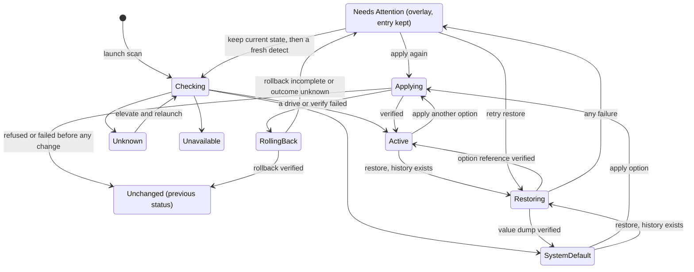
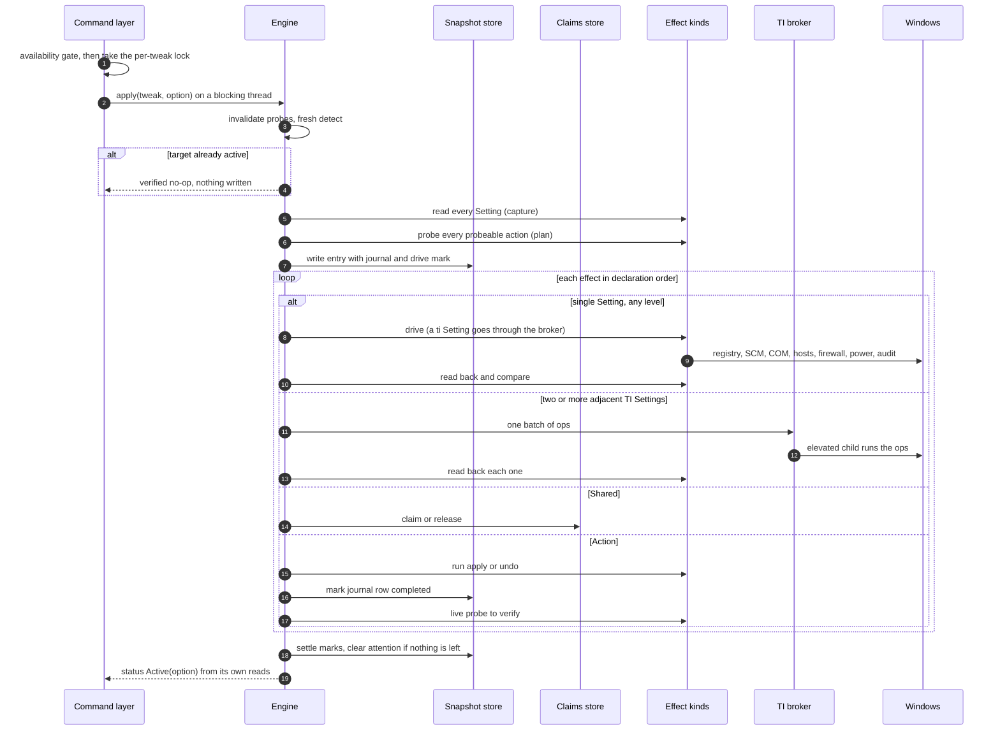
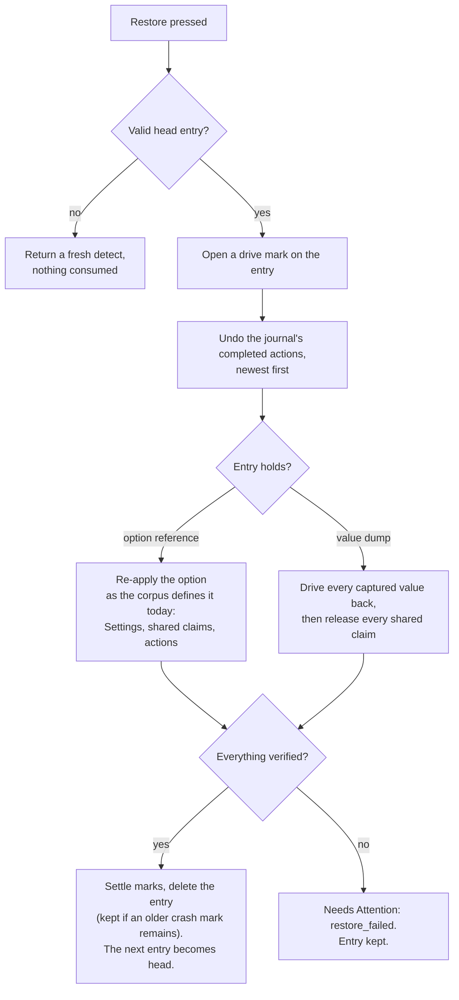

# Apply, Rollback and Restore

This is the part of the engine that changes the machine. Apply moves a tweak to a chosen option, rolls back on any failure, and leaves a snapshot entry to return to. Restore walks back through that history. Both keep enough durable bookkeeping that a crash in the middle is detected on the next launch.

Code: `src-tauri/src/tweaks/engine/apply.rs` (apply and rollback), `engine/revert.rs` (restore), `engine/lifecycle.rs` (locks, exit latch, crash scan), `engine/mod.rs` (dispatch to kinds and the broker). Related decisions: ADR-0001 (rollback failure is a state), ADR-0002 (when entries may be deleted), ADR-0003 (restore walks the history), ADR-0007 (option snapshots are references).

[Back to the index](README.md)

## A tweak's lifecycle

Needs Attention is an overlay on top of the detected status, not a separate status: a tweak can be Active and need attention at the same time.

## Apply

### Step by step

1. **Gate and lock.** The command layer refuses a tweak that is not available (wrong account, needs elevation, TrustedInstaller path blocked; see [elevation.md](elevation.md)), then takes the tweak's lock. The work runs on a blocking thread so the UI never waits on it.
2. **Fresh detect.** The engine invalidates the tweak's cached probes and detects again. If the target option is already active, the apply is a verified no-op: nothing is written or driven. If the surface is Unknown or Unavailable, it fails here, before any change.
3. **Capture.** Every applicable Setting is read. An optional effect whose resource is missing is recorded as `Missing`; a required one that is missing, or any read error, fails the apply before any change.
4. **Plan the actions.** Every probeable action is probed live, and the plan for each follows from what the target option wants:

   | Target option | Probe reads | Plan |
   | --- | --- | --- |
   | runs the action | absent | run `apply` |
   | runs the action | present | nothing: already there, not run and not journaled |
   | omits the action | present, has undo | run `undo` |
   | omits the action | present, no undo | leave it; reported as a residue |
   | runs a probe-less action | (no probe) | run `apply` |

5. **Choose the capture shape.** If the tweak was at an authored option, the entry stores a reference to that option. Otherwise (System Default or drift) it stores a dump of every captured value.
6. **Write ahead.** The entry is written to disk before the first change, with a journal row for each planned, non-ephemeral action and a mark saying a drive is open. If this write fails, the apply fails with the machine untouched.
7. **Drive and verify, in declaration order.**
   - A Setting is driven through its kind, then read back. Any difference is a verify failure.
   - Two or more **adjacent** Settings that route to TrustedInstaller are sent as one batch to a single elevated child, then each is read back. Only adjacent ones are grouped, so declaration order is preserved.
   - An optional effect whose resource is missing, and whose target is its `if_missing` value, is skipped as a no-op.
   - A Shared effect claims or releases through the claims store. The engine remembers what it did so a rollback can reverse it.
   - An action runs, is added to the in-memory list of processed steps, its journal row is marked completed (flushed to disk), and then its probe must read the expected state. A probe-less action is verified by its exit code. Ephemeral actions run but are never journaled.
8. **Success.** Probes are invalidated and the verified outcome is settled: journal rows it accounted for are resolved, drive marks are closed, and the Needs Attention record is cleared if nothing unresolved remains. The returned status is built from the operation's own reads.

## Rollback

Any failure in step 7 triggers a rollback, which runs to the end rather than stopping at its first problem (ADR-0001).

1. **Reverse the processed steps**, newest first. This is the in-memory list of what this apply actually did, not the journal on disk:
   - an action it applied runs its `undo`, verified by its probe; an action with no undo is recorded as a `no_undo` item;
   - an action it undid runs its `apply` again, verified by its probe;
   - a claim is released and a release is re-claimed, each at the level it was made at.
2. **Drive the captured state back.** Every captured Setting is driven back, with the same TrustedInstaller grouping, then verified: a value dump to its recorded values, an option reference to that option as the corpus defines it now. Effects captured as missing are skipped. A Setting that already reads as its captured value is verified by that read and not driven again, so an effect the failed apply never moved (such as a task Windows refuses to toggle) cannot fail the rollback.
3. **Report.** The returned error always carries the original failure and every rollback failure.

**What counts as "ran".** An action whose script started and then failed (non-zero exit, timeout, a failed wait) may have partly run, and a probe cannot see partial progress. So the rollback reverses it as if it ran. Only an action refused before its script was spawned, or one with an invalid definition, an unsupported level or an elevation that was never acquired, counts as not having run.

**Outcomes.**

- **Verified rollback**: the entry's marks are settled and the entry is deleted. If some mark could not be settled, the entry is kept as evidence and the crash scan records it.
- **Incomplete rollback, or an elevated step whose outcome is unknown**: a Needs Attention record (reason `apply_failed`) lists every failure, and the entry is kept.

## Restore

Restore is the only way back (ADR-0003). It always targets the **most recent valid** entry in the tweak's history.

- **Undo the journal.** Each completed journal row is reversed: an action the apply ran gets its `undo`, and an action the apply undid gets its `apply` again, each verified by its probe. Failures accumulate; the walk continues.
- **Option reference** (ADR-0007): the option is re-applied as it is defined now, including its shared claims and actions (ephemeral ones too). If a tweak's definition changed in an app update, restore produces the option as it is today, never a half-old state. Restore does not push a new entry; it works on the entry it is restoring.
- **Value dump**: the captured values are driven back exactly, including an effect that a Windows upgrade has since scoped out. A captured effect the corpus no longer defines fails the restore and keeps the entry. Every shared claim the tweak holds is released. A reboot is advised afterwards.
- **Success** deletes the entry, unless it still carries a mark an earlier crash left: then the entry is kept and the mark is recorded. The resulting status is Active or System Default, depending on what the entry held; pressing Restore again steps one entry further back. When the history is empty, the tweak simply reads as whatever the machine is. A verified restore whose entry cannot be deleted returns an error, but the machine is restored and no Needs Attention is recorded.
- **Failure** keeps the entry and records Needs Attention (when the record itself can be written).

## Keep current state and discard

- **Keep current state** is the user's explicit decision to accept the machine as it is. Under the tweak's lock it settles every mark, clears the Needs Attention record, and discards the tweak's entries (except entries another Windows account captured for a per-user tweak). It returns a fresh status. It is only offered while the tweak needs attention.
- **Discard entry** removes one chosen entry with the user's consent. It does not clear the Needs Attention record.

## Concurrency

- Each tweak has its own lock. Different tweaks can be applied at the same time; one tweak cannot be changed twice at once.
- A process-wide exit latch stops the app from closing, relaunching as administrator or installing an update while any tweak is locked, and makes a new apply fail with "app exiting" once an exit has started.
- The launch scan skips locked tweaks. A single-tweak status request on a locked tweak is refused.
- Some primitives are serialized process-wide: packed registry field writes, Task Scheduler COM calls, hosts file edits, and the probe cache.

## Traps

- **The entry is written before the first change, the journal mark after each action runs.** An action is added to the processed list before its mark is written, so an action that ran but could not be marked is still reversed by a rollback.
- **Never journal ephemeral actions.** They have no probe, so a journal row for one would look like crash residue forever.
- **Restore and every drive back to a captured state re-derive the tweak from the current corpus.** Rollback's reversal of its own processed steps uses the definition the apply ran with.
- **Registry key deletion refuses when the key holds values**, because a key capture records presence only and could not put the values back.
- **A service drive always rewrites the delayed-start flag**, even when the target is not delayed, so a stale flag cannot survive.
- **A failed elevation in a drive-back is not retried** for the rest of that run, so one blocked TrustedInstaller path does not spawn a child per effect.
- **A few helpers exist in both `apply.rs` and `revert.rs`** (ephemeral, undo and action lookups) and must be kept in step by hand.
