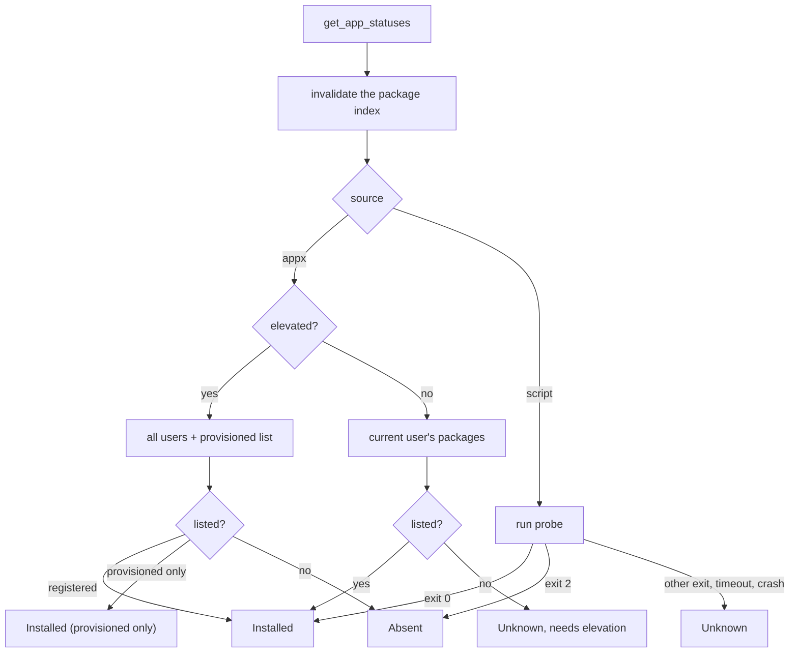

# App items

An app item is a curated, removable app authored in the same YAML files as tweaks, under `apps:`. It is not a tweak: it has no options, no snapshot, no journal, no System Default, no Restore and no Needs Attention (ADR-0009). It has a presence (Installed, Absent or Unknown) and two actions, Remove and Install, that run immediately and are verified by reading presence again.

Code: `src-tauri/src/apps/{mod,run}.rs` (presence, removal, install, install route), `src-tauri/src/commands/apps.rs` (commands and gates), `src-tauri/src/services/appx_index.rs` (the package enumeration), `src-tauri/src/tweaks/{schema,model,validate}.rs` (the `AppDef` model and its build rules), `src/lib/stores/apps.svelte.ts`, `src/lib/components/items/AppRow.svelte`.

[Back to the index](README.md)

## Model and build

`build.rs` loads `apps:` from every category file next to the tweaks, validates them, and embeds them as a second JSON value beside the corpus; `tweaks::compiled_apps()` returns them. An app takes its category from its file, like a tweak.

| Field | Meaning |
| --- | --- |
| `id`, `name`, `description`, `info`, `warning`, `risk_level`, `windows` | As for a tweak. Ids share the tweak id space, compared case-insensitively. `windows:` may not set `revision`. |
| Source | Exactly one of `appx: [package names]` or `script: { probe, remove, timeout? }`. |
| `install` | Optional, at most one of `store: <Store product id>`, `winget: <winget id>` or `store_page: <Store product id>`. |

There is no `elevation:` field and no `reversible:` field: the levels are fixed (see [Gates](#gates)), and there is nothing to reverse. Package names, Store ids and winget ids are checked against strict character sets at build time and again before a script is generated, because they are embedded verbatim in PowerShell. App errors are reported in their own build phase, `APP VALIDATION FAILED`.

## Presence

- **AppX items** are answered from one shared enumeration (`Get-AppxPackage -AllUsers` plus `Get-AppxProvisionedPackage -Online`), built once per scan and cached with its failure. Asking about one package costs as much as listing all of them, so a scan pays one PowerShell spawn for every app. Unelevated, `-AllUsers` is unavailable, so the index lists only the current account: a hit is Installed, a miss is Unknown with `needs_elevation`, never Absent. An enumeration failure is Unknown.
- **Script items** run their `probe` through the action runner with the fixed probe timeout. Exit 0 is Installed and exit 2 is Absent. Exit 1 is deliberately not Absent: an uncaught PowerShell error exits 1, and reading that as "absent" would hide an installed app. Any other result is Unknown. When another account elevated the app, the probe is not run and presence is Unknown, because its per-user paths would be that account's.
- **Out-of-scope items** (their `windows:` scope excludes the running build) are listed with `supported: false` and presence Unknown, "Not available on this Windows build"; the UI hides them unless Settings > Tweaks > Show tweaks this PC cannot run is on.
- Every scan and every re-check invalidates the index first. The apps module owns its own `AppxIndex`; the tweak engine has none.

## Install route

Each scan also reports how the app could come back on this machine. winget counts as available when `%LOCALAPPDATA%\Microsoft\WindowsApps\winget.exe` exists for the running account (checked with `symlink_metadata`, because it is an app execution alias); the Store counts as available when the `HKCR\ms-windows-store` protocol key exists.

| Authored `install` | winget available | Store available | Route |
| --- | --- | --- | --- |
| `store` | yes | any | `winget` (from the `msstore` source) |
| `store` | no | yes | `store_page` |
| `winget` | yes | any | `winget` (from the `winget` source) |
| `store_page` | any | yes | `store_page` |
| anything else, or none | | | `none` |

## Remove and install

- **Remove, AppX.** The backend generates the script from the validated names: for each package a bundle pass (`-PackageTypeFilter Bundle`), a plain pass, then `Remove-AppxProvisionedPackage -Online` for the matching provisioned copy, all with `$ErrorActionPreference = 'Stop'` inside one `try`. The `catch` exits with the exception's HRESULT (0 remapped to 1), so the error names the cause, for example 0x80073CFA. Timeout 600 seconds.
- **Remove, script.** Runs the authored `remove` with its `timeout` (default 600 seconds).
- **Install.** Only the `winget` route runs in the backend: `winget install --id <id> -e --source msstore|winget --accept-source-agreements --accept-package-agreements`, timeout 1800 seconds. The `store_page` route is opened by the frontend (`ms-windows-store://pdp/?ProductId=<id>`) and is not verified; the row checks presence again when the window regains focus.
- **Did it work.** A non-zero exit is an error. Otherwise the index is invalidated and presence read again: after Remove it must be Absent, after Install it must be Installed, or the command fails with the reason. An AppX package still registered after a successful removal usually belongs to another signed-in account, and the error says so.
- **Taskbar.** While any Remove or Install runs, the taskbar button shows a busy bar (`src-tauri/src/taskbar.rs`); it clears when the last one ends, turns red when one failed while the window was in the background (until the window is focused again), and the button flashes when a job ends in the background.

## Gates

| Command | Purpose | Gating |
| --- | --- | --- |
| `get_apps` | The app items as view types, with each one's install source and the availability of Remove and Install. Items this Windows build excludes carry `supported: false`. | none |
| `get_app_statuses` | One presence scan, with the install route and a status stamp per app. Apps whose lock is held are left out. | none |
| `remove_app` | Removes one app and returns its new status. | Windows scope, availability (`admin`), then the app's lock |
| `install_app` | Installs one app through winget and returns its new status. | Windows scope, availability (`user`), then the app's lock |

- **Levels are fixed.** Remove needs `admin`. Install runs at `user`. The account guard applies to Install always (the app lands in the running account) and to Remove for script items (their paths may be per-user); an AppX removal is machine-wide.
- **The lock is the tweak lock.** Remove and Install take the same per-id lifecycle lock as an apply, so closing the window, restarting as administrator and installing an update wait for them, and a status scan skips the app while it runs.
- **Errors** reach the frontend as `APP_UNAVAILABLE` (refused before anything ran) or `APP_FAILED` (failed or unverified).

## Frontend

- Apps render as rows in their own "Apps" section of the category view, after the tweak rows and outside their empty state, and not while the Needs attention pill narrows the list. A row shows the app's `warning:` behind a Warning toggle; the Remove confirmation repeats it. The scoped and the global search both cover them.
- **Remove** asks for confirmation (a danger dialog that says whether removal covers every account, for AppX items, or only yours, for script items) and then runs at once; it is never staged into pending changes. **Install** runs at once without confirmation. Each row has its own spinner and the UI never blocks.
- **Visibility**: an app is shown unless it is Absent with no install route. Unknown is always shown, with its buttons disabled, because hiding it would fail open.
- **Permanent**: an app whose route is `none` is marked Permanent on its row, and its Remove confirmation says the change cannot be undone.
- Favorites, the Overview and navigation pane counts, the applied counter, the pending bar, Restore all and profiles ignore apps. Favorites drop ids they do not know when they load.

## Traps

- **A feature update can re-provision a removed app.** The app then reads Installed again; nothing in the app prevents it.
- **Status stamps order results.** A scan that started before a removal stamps lower than the removal's own result, so it cannot overwrite it.
- **A provisioned-only app reads Installed**, because Windows installs it into every new account.
- **Opening the Store page proves nothing.** Only the focus re-check moves the row.
