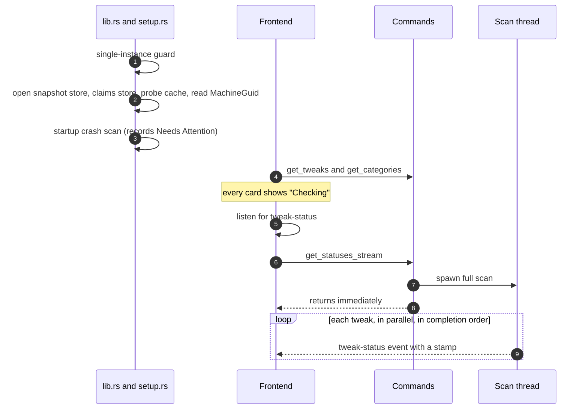
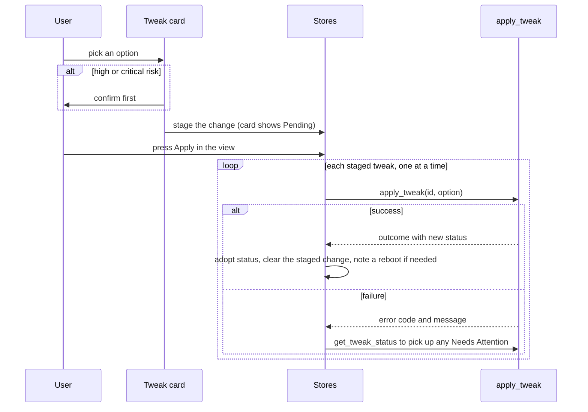

# Commands and UI

This is everything between the engine and the user. A thin Tauri command layer builds the engine's dependencies, gates and serializes every operation that changes the machine, and translates engine results into view types. On the frontend, Svelte rune stores hold the catalog and per-tweak statuses, which the background scan fills in, and the tweak cards render each status.

Code: `src-tauri/src/commands/tweaks.rs` (commands and view types), `src-tauri/src/commands/elevation.rs`, `src-tauri/src/setup.rs`, `src-tauri/src/lib.rs` (registration and window events), `src/lib/stores/tweaks*.svelte.ts`, `src/lib/components/tweaks/`.

[Back to the index](README.md)

## Command surface

| Command | Purpose | Gating |
| --- | --- | --- |
| `get_tweaks` | The catalog as view types, with each tweak's required level and availability computed at call time. Release builds leave out tweaks this Windows build cannot run. | none |
| `get_categories` | Category metadata. | none |
| `get_statuses_stream` | Starts the full background scan and returns at once. Statuses arrive as events. | none |
| `apply_tweak` | Applies one option to one tweak. Returns the outcome and the new status. | availability, then the tweak's lock |
| `restore_tweak` | Restores the tweak's most recent snapshot entry. | availability, then the tweak's lock |
| `get_tweak_status` | A fresh detect of one tweak. Refused, not queued, while the tweak is locked. | none |
| `list_snapshot_entries` | The tweak's history, valid and invalid, oldest first. | none |
| `discard_snapshot_entry` | Deletes one entry on the user's say-so. Refuses another account's entry. | the tweak's lock |
| `keep_current_state` | Accepts the machine as it is: settles marks, clears Needs Attention, discards entries. | the tweak's lock |
| `get_elevation_state` | The app's level and whether the account guard trips. | none |
| `rescan_after_elevation` | Starts another full scan. | none |
| `restart_as_admin` | Relaunches the app elevated through UAC. | exit latch |

The test build adds the Manual Tests run, list and cancel commands, which drive the same gated apply and restore paths (`manual_tests_available` exists in every build); see [MANUAL_TESTS.md](../../MANUAL_TESTS.md).

### Gates

- **Availability**: account guard, then needs elevation, then elevation path unavailable. See [elevation.md](elevation.md#the-availability-gate). Restore is gated like apply; discard and keep current state are not, since they change no Windows state.
- **Per-tweak lock**: one async lock per tweak, held across the engine call, which runs on a blocking thread.
- **Exit latch**: closing the window, relaunching as admin and installing an update all refuse while any tweak is locked. A window close attempt emits a `close-blocked` event that the title bar shows as a toast. Once an exit has started, a new apply fails with `APP_EXITING`.
- **Error shaping**: engine errors reach the frontend as a code and a user-facing message with broker details removed. Snapshot store errors reach it as a generic reason.

## Launch sequence

- The backend does not scan by itself; the frontend starts the scan once it has the catalog, and registers its event listener first so no status is missed.
- A status that arrives before its tweak is in the model is buffered and applied when the model loads.
- Every status carries a stamp; the frontend ignores a status older than the one it holds.

## User flows

### Apply

- Picking an option never applies it; the view's Apply button runs the staged changes one after another.
- An `APP_EXITING` error stops the loop and reports how many changes were skipped, without a re-read, because nothing was touched.

### Restore, discard, keep

- **Restore** (the card's Restore button, shown when a history exists, disabled unless the tweak is available) calls `restore_tweak` and adopts the returned status. On failure the card re-reads the status; when a `restore_failed` record was written, the button becomes "Retry" and the tweak needs attention.
- **Details view** lists the snapshot entries (valid and invalid, with reasons) and lets the user discard one, after confirmation.
- **Keep current state** appears only while the tweak needs attention, and asks for confirmation.

## Frontend state

| Store | Holds |
| --- | --- |
| `tweaksData` | The catalog with each tweak's status, category metadata, system info, elevation state, status stamps and buffered early statuses. |
| `tweaksLoading` | Which tweaks are being changed right now, and per-tweak errors. |
| `tweaksPending` | Staged option changes, and tweaks waiting for a reboot. |
| `tweaksActions` | Search and filter state, and the apply, restore and keep-current-state actions (single and batch). The details view calls discard directly. |

### What the user sees

| State | Shown as |
| --- | --- |
| Checking | Spinner badge, nothing selected, until the first status arrives. |
| Active | The option is selected; accent border. |
| System Default | A "System Default" position appears on the switch (between the two options, or before a single option) or at the top of the dropdown, **only while it is the detected state**. The details view shows the observed values. |
| Unknown | Warning badge, "needs elevation" when that is the cause, nothing selected. |
| Unavailable | Badge, control disabled with the reason. |
| Unavailable option | The option is labelled "(unavailable)" and cannot be chosen. |
| Blocked by availability | Badge with the reason; control and Restore disabled. |
| Needs Attention | Red badge; Restore becomes "Retry" after a failed restore; Keep current state appears. |
| Shared | Badge listing the shared settings held and by whom. |
| Residue | Badge. |
| Applying | Control disabled with a loading state. |

**Switch or dropdown.** One or two authored options render as a segmented switch; three or more render as a dropdown.

**System Default is never a target.** Choosing it from the control only unstages a pending change. The only way back to an earlier state is the Restore button (ADR-0003).

## Profiles

The profile system is not wired to the tweak engine. There is no profile backend; the frontend profile API rejects every call. The profile import flow calls `rescan_after_elevation` when it finishes, so that command has no reachable caller today. [The v1 format record](../../spec/profile-v1.md) documents the archive format; [PROFILE_SYSTEM.md](../../PROFILE_SYSTEM.md) describes a profile backend the current code does not have.

## Traps

- **Availability is computed when the catalog loads** and is not refreshed by a rescan. Elevation changes are covered because Elevate relaunches the app.
- **The availability check runs before the lock**, and commands call the engine's variants that expect the lock to be held already, so it is never taken twice.
- **A re-read during another change fails** (the single-tweak status is refused while locked) and shows as "could not be re-read".
- **Tweaks hidden in a release build can still be applied by id** over IPC; only the catalog and scan events are filtered.
- **The tweak system uses two events**: `tweak-status` and `close-blocked`.
