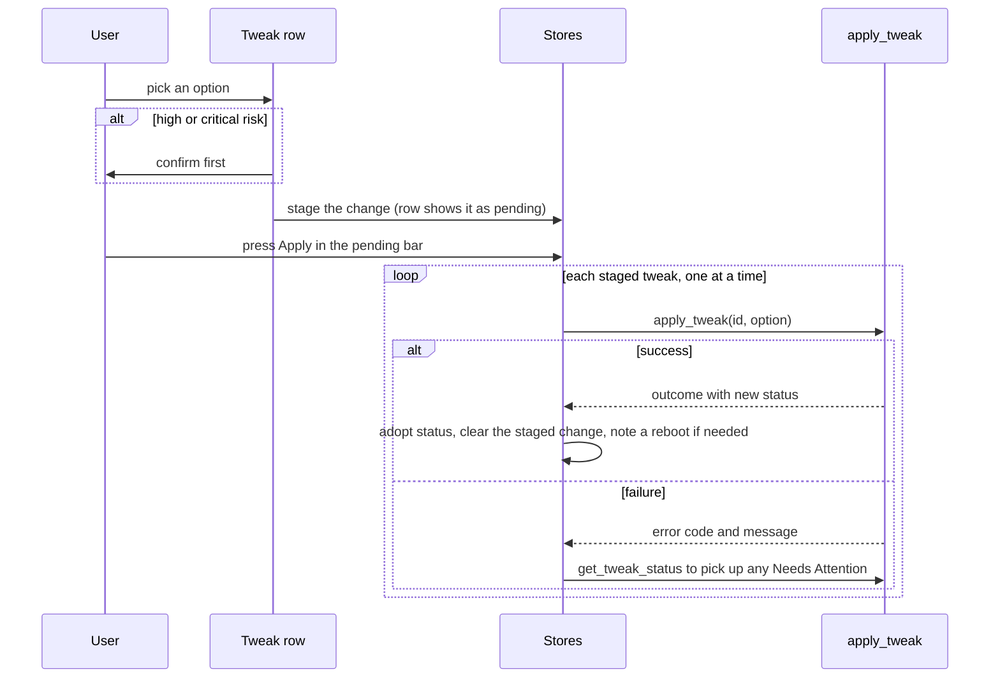

# Commands and UI

This is everything between the engine and the user. A thin Tauri command layer builds the engine's dependencies, gates and serializes every operation that changes the machine, and translates engine results into view types. On the frontend, Svelte rune stores hold the catalog and per-tweak statuses, which the background scan fills in, and the tweak rows render each status.

Code: `src-tauri/src/commands/tweaks.rs` (commands and view types), `src-tauri/src/commands/elevation.rs`, `src-tauri/src/setup.rs`, `src-tauri/src/lib.rs` (registration and window events), `src/lib/stores/tweaks*.svelte.ts`, `src/lib/components/tweaks/`.

[Back to the index](README.md)

## Command surface

| Command | Purpose | Gating |
| --- | --- | --- |
| `get_tweaks` | The catalog as view types, with each tweak's required level and availability computed at call time. Release builds leave out tweaks this Windows build cannot run. | none |
| `get_categories` | Category metadata. | none |
| `get_statuses_stream` | Starts the full background scan and returns at once. Statuses arrive as events. | none |
| `apply_tweak` | Applies one option to one tweak. Returns the outcome and the new status. | availability, then the tweak's lock |
| `restore_tweak` | Restores the tweak's most recent snapshot entry. | availability, then the tweak's lock |
| `get_tweak_status` | A fresh detect of one tweak. Refused, not queued, while the tweak is locked. | none |
| `list_snapshot_entries` | The tweak's history, valid and invalid, oldest first. | none |
| `discard_snapshot_entry` | Deletes one entry on the user's say-so. Refuses another account's entry. | the tweak's lock |
| `keep_current_state` | Accepts the machine as it is: settles marks, clears Needs Attention, discards entries. | the tweak's lock |
| `get_elevation_state` | The app's level and whether the account guard trips. | none |
| `rescan_after_elevation` | Starts another full scan. | none |
| `restart_as_admin` | Relaunches the app elevated through UAC. | exit latch |

App items have their own commands (`get_apps`, `get_app_statuses`, `remove_app`, `install_app`), gated by the same availability check and per-id lock; see [apps.md](apps.md#gates).

The test build adds the Manual Tests run, list and cancel commands, which drive the same gated apply and restore paths (`manual_tests_available` exists in every build); see [MANUAL_TESTS.md](../../MANUAL_TESTS.md).

### Gates

- **Availability**: account guard, then needs elevation, then elevation path unavailable. See [elevation.md](elevation.md#the-availability-gate). Restore is gated like apply; discard and keep current state are not, since they change no Windows state.
- **Per-tweak lock**: one async lock per tweak, held across the engine call, which runs on a blocking thread.
- **Exit latch**: closing the window, relaunching as admin and installing an update all refuse while any tweak or app item is locked. A window close attempt emits a `close-blocked` event that the title bar shows as a toast. Once an exit has started, a new apply fails with `APP_EXITING`.
- **Error shaping**: engine errors reach the frontend as a code and a user-facing message with broker details removed. Snapshot store errors reach it as a generic reason.

## Launch sequence

- The backend does not scan by itself; the frontend starts the scan once it has the catalog, and registers its event listener first so no status is missed.
- A status that arrives before its tweak is in the model is buffered and applied when the model loads.
- Every status carries a stamp; the frontend ignores a status older than the one it holds.

## User flows

### Apply

- Picking an option never applies it. One floating pending bar serves every view: it lists the staged changes (each can be unstaged), its Apply button runs them one after another without a further confirmation, and Discard clears them all.
- An `APP_EXITING` error stops the loop and reports how many changes were skipped, without a re-read, because nothing was touched.

### Restore, discard, keep

- **Restore** (the row's Restore action, shown when a history exists and the tweak does not need attention; while it does, the row's Needs Attention callout and the details panel carry Restore instead; disabled unless the tweak is available) calls `restore_tweak` and adopts the returned status. On failure the store re-reads the status; when a `restore_failed` record was written, the button becomes "Retry restore" and the tweak needs attention.
- **Details panel** (opened from a row's Details action or by clicking the row; docked beside the list when the content area is at least 1040px wide, otherwise an overlay dialog) lists the snapshot entries (valid and invalid, with reasons) and lets the user discard one, after confirmation.
- **Keep current state** appears only while the tweak needs attention, and asks for confirmation.

## Frontend state

| Store | Holds |
| --- | --- |
| `tweaksData` | The catalog with each tweak's status, category metadata, system info, elevation state, status stamps and buffered early statuses. |
| `tweaksLoading` | Which tweaks are being changed right now, and per-tweak errors. |
| `tweaksPending` | Staged option changes, and tweaks waiting for a reboot. |
| `tweaksActions` | Search and filter state, and the apply, restore and keep-current-state actions (single and batch). The details panel calls discard directly. |
| `apps` | App item views, presence statuses, per-app busy and error state, and the Remove, Install and Get in Store actions. Outside pending changes, snapshots and profiles. |

### What the user sees

| State | Shown as |
| --- | --- |
| Checking | "Checking" with a spinner on the row's meta line, nothing selected, until the first status arrives. |
| Active | The option is selected and named on the meta line; accent stripe on the row's left edge. |
| System Default | A "System Default" position appears on the switch (between the two options, or before a single option) or at the top of the dropdown, **only while it is the detected state**. The details panel shows the observed values. |
| Unknown | "Unknown" in warning colour on the meta line ("Unknown, needs admin" when elevation is the cause), the unreadable effects in its tooltip, nothing selected. |
| Unavailable | "Unavailable" on the meta line; control disabled, the reason in its tooltip. |
| Unavailable option | The option is labelled "(unavailable)" and cannot be chosen. |
| Blocked by availability | A meta-line label (Needs admin, Different account, Account unconfirmed, Not available on this PC) with the reason in its tooltip; control and Restore disabled. A category view with tweaks that need admin shows one notice with Restart as admin. |
| Needs Attention | Red stripe and a Needs Attention callout on the row with Restore ("Retry restore" after a failed restore) and Keep current state. |
| Shared | "Shared" on the meta line; its tooltip lists the shared settings held and by whom. |
| Residue | "Residue" on the meta line; its tooltip lists the residual settings. |
| Applying | Control disabled with a loading state. |

**Switch or dropdown.** One authored option renders as an on/off switch: on stages it, off unstages it or, once applied, restores the snapshot. Two render as a segmented switch, three or more as a dropdown.

**Rows and panes.** Every view lists tweaks as full-width rows, one per line. A row shows the title, the description, the authored `warning:` as a callout, then a meta line (state, pending target, risk, permission level, Restart, availability, Residue, Shared) ending in Restore, the favourite star and Details. The control sits right of the text and moves under it when the row is narrower than 520px or the switch labels are long. At 1400px of content width and above, category, Favorites and Snapshots views show an At a glance pane while no tweak is selected: applied progress by state, and lists of tweaks that need attention, are ready to apply, have an unknown state or wait for a restart, each opening the details panel.

**System Default is never a target.** No control offers it: at System Default the control shows no selection and the state line names it. A staged change is undone from the row's Undo link or the pending bar. The only way back to an earlier state is Restore (ADR-0003), which steps back one snapshot entry.

**Confirming risk.** Staging never asks for confirmation. Apply opens a review of every staged change (from → to, risk, restart, the authored warning) when any of them is high or critical risk; otherwise it applies at once. Restore on a high or critical risk tweak, Keep current state, and discarding a snapshot entry each confirm through one shared dialog. Bulk Restore buttons count only tweaks the user can restore right now.

## Profiles

The profile system is not wired to the tweak engine. There is no profile backend; the frontend profile API rejects every call. The profile import flow calls `rescan_after_elevation` when it finishes, so that command has no reachable caller today. [The v1 format record](../../spec/profile-v1.md) documents the archive format; [PROFILE_SYSTEM.md](../../PROFILE_SYSTEM.md) describes a profile backend the current code does not have.

## Traps

- **Availability is computed when the catalog loads** and is not refreshed by a rescan. Elevation changes are covered because Elevate relaunches the app.
- **The availability check runs before the lock**, and commands call the engine's variants that expect the lock to be held already, so it is never taken twice.
- **A re-read during another change fails** (the single-tweak status is refused while locked) and shows as "could not be re-read".
- **Tweaks hidden in a release build can still be applied by id** over IPC; only the catalog and scan events are filtered.
- **The tweak system uses two events**: `tweak-status` and `close-blocked`. App statuses are not streamed; `get_app_statuses` returns one scan.
