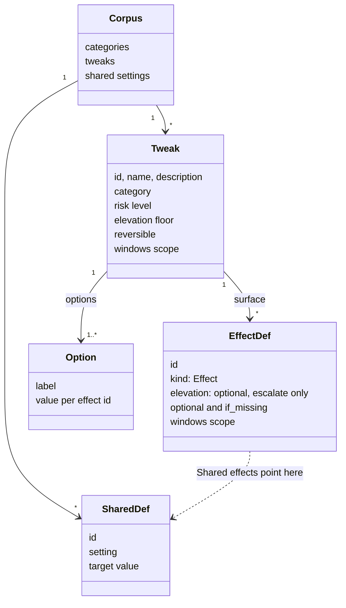
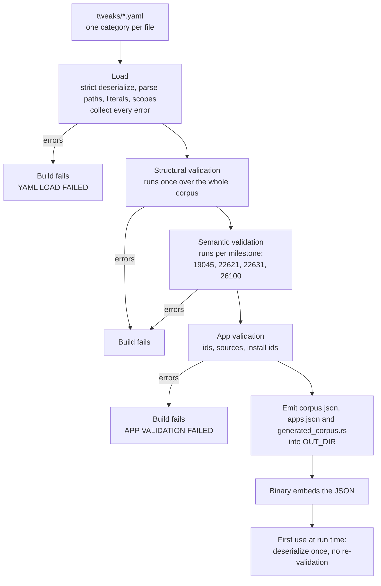
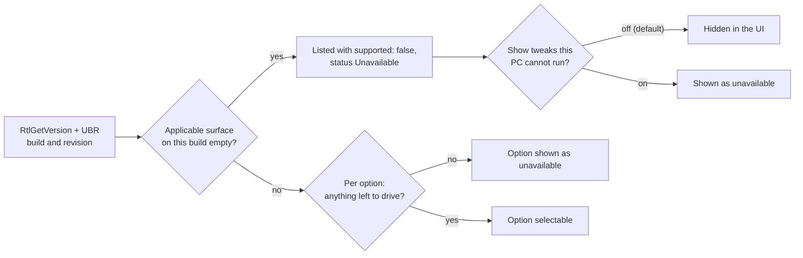

# Corpus and Build Pipeline

This layer turns the YAML files in `src-tauri/tweaks/` into one typed corpus of categories, tweaks and shared settings, proves the corpus safe at compile time, and embeds it in the binary. At run time the app only deserializes what the build already proved. It also owns the Windows version primitives that decide which tweaks, effects and options apply to the running machine.

[Back to the index](README.md)

## The model

Every other component consumes these types (`src-tauri/src/tweaks/model.rs`). They are plain data. The little behaviour attached to them (an effect's effective elevation level, whether a Windows scope applies to a build) lives in small free functions and in `winver.rs`.

### Effects

An effect is one of three things:

- **Setting**: a readable, drivable address. Eight kinds: registry value (optionally one field inside a packed `key=value;` string), registry key presence, service startup type, scheduled task enabled state, hosts file entry, firewall rule presence, one power plan setting of the active scheme (its AC and DC indexes together), and one flag (success or failure) of an advanced audit policy subcategory. Settings are always detectable and always reversible, because the engine can read the old value and write it back.
- **Shared**: a reference to a corpus-wide shared setting. Options say `claim` or `unclaimed` for it, never a value. See [persistence.md](persistence.md#shared-claims).
- **Action**: a script (PowerShell or cmd) with an `apply`, and optionally an `undo` and a `probe`. An action is reversible only if it has an undo, and detectable only if it has a probe. A probe can be a script or a registry DWORD check. Removing an app is not an action: it is an [app item](apps.md). An **ephemeral** action (for example "restart Explorer") has neither and exists only to make a change take effect.

### Values

One value type serves capture, apply, detection and restore:

| Value | Meaning |
| --- | --- |
| `Absent` | The registry value does not exist (written as `absent` in YAML). |
| `Missing` | The resource itself (a service, a task) does not exist on this machine. Only ever captured, never authored. |
| `Reg` | A typed registry value: DWORD, QWORD, string, expandable string, multi-string or binary. |
| `Startup` | A service startup type, from boot to disabled, including automatic delayed. |
| `TaskEnabled` | Whether a scheduled task is enabled. |
| `Present` | Whether a key, hosts entry or firewall rule exists. |
| `PowerIndex` | A power setting's AC (plugged in) and DC (on battery) indexes. A reading also carries the plan it came from, so a captured value goes back to that plan; the plan never takes part in comparison. |
| `Audited` | Whether an audit policy flag is on. |

`Absent` and `Present(false)` are different values by construction, so a registry value that was deleted can never be confused with a key that does not exist. The only way to author a deletion is the keyword `absent`; a `null` (an empty YAML node) or omitted value is a build error (ADR-0004). A quoted empty string `""` is a valid string value.

### Options

An option is a label plus one value for every effect on the tweak's surface. Each value can carry its own Windows scope; outside that scope the option has no answer for the effect. Writing different values on different Windows versions needs separate effects with non-overlapping effect-level scopes. System Default is never an option: it is what detection reports when no option matches (ADR-0003).

### Windows scope

A scope can sit on a whole tweak, on one effect, or on one option value. It combines `products` (10 means builds 10240 to 19045, 11 means build 22000 and later) with a `build` expression (`N`, `>=N`, `<=N` or `A..B`). An effect whose scope excludes the running build is dropped from the surface; an option value outside its scope counts as "no answer" for that effect.

## Build pipeline

### Same code at build time and run time

`build.rs` includes the runtime's own `model`, `parse`, `schema` and `validate` source files by path, so the build and the app share one definition of the model. Changing a type in one place changes it in both; a mismatch is a compile error rather than silent drift. The YAML parser (`serde_yaml_bw`) is a build and test dependency only; the shipped app never parses YAML. The loader itself (`schema.rs`) is compiled into the app only for tests.

### Structural guards (run once)

- Tweak ids use `[a-z0-9_]` and are unique ignoring case, because each id names a folder under `snapshots/`.
- **One address, one owner** (ADR-0006): no two owners (effects of any tweak, including two effects of the same tweak, or shared setting declarations) may manage the same registry value, service, task, hosts entry, firewall rule, power setting or audit flag, unless their Windows scopes never overlap. A packed registry value is either owned whole or split by field, with one owner per field; an audit subcategory is split by flag the same way. Registry, service and task names compare case-insensitively, and power and audit GUIDs are stored in one canonical spelling. A shared setting counts as owning its address on every build.
- **Key subtrees**: nothing another owner manages may sit beneath a `registry_key` effect, whether or not that key is ever driven absent. Within one tweak, a value may not sit beneath a key that tweak can drive absent.
- **Kind canonicalization**: a service's `Start` value, a task's registry storage or a power scheme's stored indexes must be managed through the Service, Task or power setting kind, never as a raw registry value, so one state cannot be claimed through two routes.
- No typed effect may disable the TrustedInstaller service, because the app's own elevation path depends on it.
- **Coverage**: every option gives a value for every Setting effect, and an explicit `claim` or `unclaimed` for every Shared effect.
- The declared `reversible` flag must equal the computed one.
- `if_missing` requires `optional`. An ephemeral action has no undo or probe. An effect no broker operation carries (an action, a hosts entry, a firewall rule, a power setting, an audit flag, or an HKLM packed registry field) may never run at the `ti` level. Action timeouts are 1 to 1800 seconds.
- A `revision` scope is rejected everywhere (see [Traps](#traps)).

### Semantic guards (run per milestone)

For each of the four milestones, the validator takes every tweak's applicable surface on that build and checks:

- **Detectability**: every option has at least one non-optional effect that detection can read. A Shared effect only counts where the option claims it.
- **Distinctness**: no two options can look the same to detection. The check cascades from byte-identical options, through options that differ only in probe-less actions, to options that differ only in shared claims, and finally requires a reliable distinguisher (a Setting, or an action with both probe and undo). This is what lets detection promise that at most one option matches.

An empty surface on a milestone is skipped, not an error: the tweak simply does not exist on that build. Each violation is reported once, at the first milestone it appears on.

## Run-time gating by Windows build

- The build number comes from `RtlGetVersion`, never `GetVersionEx`, whose compatibility shim under-reports the version to an unmanifested process. The revision comes from the `UBR` registry value. If either read fails the value is 0.
- The catalog lists every tweak, flagging one whose surface is empty on the running build as `supported: false`; detection reports it as Unavailable. The UI hides unsupported tweaks and apps unless Settings > Tweaks > Show tweaks this PC cannot run is on, so lists, counts and search leave them out; lookups by id still find them. Categories are not filtered.
- The engine repeats the check: apply on an unavailable tweak fails before touching anything, and the effects it drives are computed with the full scope rules for the running build.

## Interfaces

- `tweaks::compiled_corpus()` is the single entry point to the loaded corpus. The command layer, the engine, the snapshot classifier and the manual tests all read it. App items are a sibling value, `tweaks::compiled_apps()`, loaded from the same files (see [apps.md](apps.md)).
- The scope helpers in `validate.rs` (`applicable_surface`, `applicable_value`, `option_unavailable`, `scope_admits`) are shared by the validator, detection, apply and snapshot classification, so "does this apply here" has one answer everywhere.
- `winver.rs` supplies the running build to the command layer and the engine.

## Traps

- **`revision` scopes are parsed but rejected.** The runtime honours them, but the validator refuses every use, so none ship. Enabling them needs validator and test work, not just YAML.
- **Only four builds are proven.** On a build outside the milestone list (for example a newer Insider build), option-level scope gaps can make options unavailable even though the corpus passed every guard.
- **Build 0 hides product-scoped tweaks.** If `RtlGetVersion` fails, every tweak scoped to Windows 10 or 11 is flagged unsupported and hidden by default.
- **Some model variants are not authorable.** The model and engine support a `DeleteTree` action and a firewall rule as a shared setting, but the YAML schema has no spelling for either.
- **Hosts and firewall ownership keys are case-sensitive**, unlike registry, service and task keys.
- **Hidden tweaks remain reachable by id.** The release-build filter applies to the catalog and scan events only. Commands such as `apply_tweak` look tweaks up in the whole corpus.
- **The embedded JSON is trusted.** A corrupt corpus would panic on first access; the build is what prevents that.
- Category order follows the sorted YAML file names.
