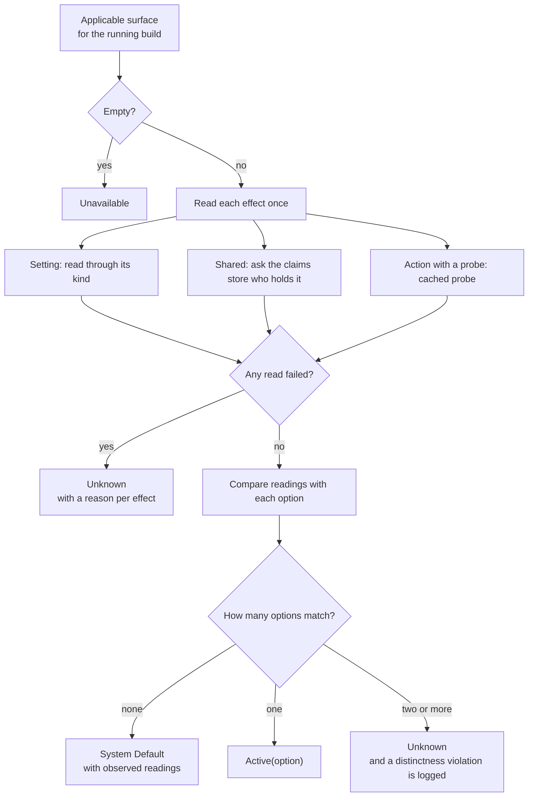

# Detection

Detection answers one question per tweak: which of its options is the machine in right now? It reads the live surface once, compares the readings with every option, and returns a status. Detection never changes the machine, never guesses, and never escalates privilege to read something.

Code: `src-tauri/src/tweaks/engine/detect.rs`, with the probe cache in `engine/mod.rs` and read routing in `engine/context.rs`. Related decisions: ADR-0003 (System Default is computed), ADR-0005 (reads run at the app's current level), ADR-0006 (shared claims count as matching).

[Back to the index](README.md)

## Statuses

A tweak's status is exactly one of these:

| Status | When |
| --- | --- |
| **Active(option)** | The live surface matches exactly one authored option. |
| **System Default** | The live surface matches no option. Carries the observed readings and which options wanted each value, so the UI can show "your system right now". |
| **Unknown** | At least one effect could not be read. Carries a reason per effect, and a "needs elevation" hint when the cause was access denied. |
| **Unavailable** | The tweak has no applicable effects on this Windows build. |

Alongside the status, detection reports:

- **Unavailable options**: options whose Windows scope excludes this build, or that need a resource (a service, a task) this machine does not have.
- **Held shared settings**: the shared settings on this tweak's surface that are currently held, and by whom.
- **Residues**: actions whose effect is still present although the active option does not run them and they have no undo.
- **History and attention**: whether a snapshot history exists (so Restore can be offered) and any Needs Attention record, both read from the [snapshot store](persistence.md).

## How a status is computed

### Reading the surface

- **Settings** are read through their effect kind. A resource that does not exist reads as `Missing`. If the effect is `optional`, the reading becomes its `if_missing` value (or `Missing` if none is declared). If it is not optional, the tweak is Unknown. Access denied makes the tweak Unknown with the elevation hint. A value of the wrong registry type, or a packed string that does not parse, makes it Unknown as malformed.
- **Shared** effects ask the claims store for the current holders. An unreadable claims file makes the tweak Unknown.
- **Actions** contribute only when they are scripts with a probe. The probe says whether the action's effect is present.

One unreadable effect makes the whole tweak Unknown. Detection does not report a partial answer, because a partial answer could name the wrong option.

### Matching an option

- A **Setting** matches when the reading equals the option's value.
- A **Shared** effect matches `claim` when anyone holds the claim and `unclaimed` when nobody does. A claimed setting therefore counts as matching for every tweak that claims it, while any claim holds.
- An **Action** the option runs needs its probe to read present. An action the option does not run must not read present if it has an undo; if it has no undo, it is tolerated and reported as a residue.
- An option whose scope excludes this build, or that authors a real value where the resource reads `Missing`, is marked unavailable and cannot match.

The validator's distinctness guard proves at build time that at most one option can match. If two ever do at run time, detection logs it and reports Unknown rather than picking one.

### Read privilege

Reads run at whatever level the app has right now, never higher. A registry value under the current user's hive is always read as the interactive user. TrustedInstaller-protected resources can legitimately deny reads to an Admin process; such a tweak reads Unknown with the elevation hint until the user elevates. See [elevation.md](elevation.md).

## The probe cache

Script probes spawn a process, so their answers are cached for the app session, keyed by tweak and effect.

- The native registry DWORD probe is answered inside the engine without spawning anything. App presence is not a probe; see [apps.md](apps.md).
- Apply invalidates the tweak's cached probes before it starts and again when it finishes; restore invalidates them when it finishes.
- A generation counter prevents a race: a probe that started before an invalidation never stores its (now stale) answer.
- Apply's own planning and verify probes, rollback and restore probe live, because their decisions must reflect the machine as it is at that moment. Apply's initial detect does go through the cache, immediately after invalidating it, so it also reads live.

## When detection runs

| Trigger | What runs |
| --- | --- |
| App launch | The frontend starts a full background scan after it has the catalog. The backend detects every tweak in parallel and emits one `tweak-status` event per tweak, in completion order. |
| After apply or restore | No full re-scan. The status comes from the operation's own reads (a no-op apply returns its own pre-detect). A restore with no valid entry returns a fresh detect, and a restore that lands on System Default runs one detect to fill in the observed readings. |
| After a failed apply, restore or keep-current-state, or after discarding a snapshot entry | A single-tweak `get_tweak_status`. |
| Elevate | The app relaunches elevated, and the new process runs its own launch scan. |
| Profile import finished | A full re-scan through `rescan_after_elevation` (the profile flow is not reachable today; see [commands-and-ui.md](commands-and-ui.md#profiles)). |

There is no periodic or focus-triggered refresh. If Windows or another tool changes a setting while the app is open, the card shows the old status until the next launch or the next operation on that tweak.

### Ordering and concurrency

- The scan skips any tweak whose lock is held at that moment (apply, restore, discard or keep current state), and emits nothing for it; the operation's own outcome will update the card.
- Every status carries a stamp from one process-wide counter. The frontend drops a status whose stamp is older than the one it already holds, so a slow scan result can never overwrite a newer apply outcome (and hide a Needs Attention it recorded).
- A single-tweak status request made while that tweak is locked is refused rather than queued.

## Traps

- **Never add a re-scan after apply or restore.** The outcome status comes from the operation's own reads; a re-scan could race another change and report a state the operation never verified. A test pins this.
- **Invalidate probes before the apply's own detect.** Apply's no-op decision (the target option is already active) depends on a live reading.
- **An unreadable history is reported as "has history"**, so the Restore button stays offered rather than disappearing on a transient read error.
