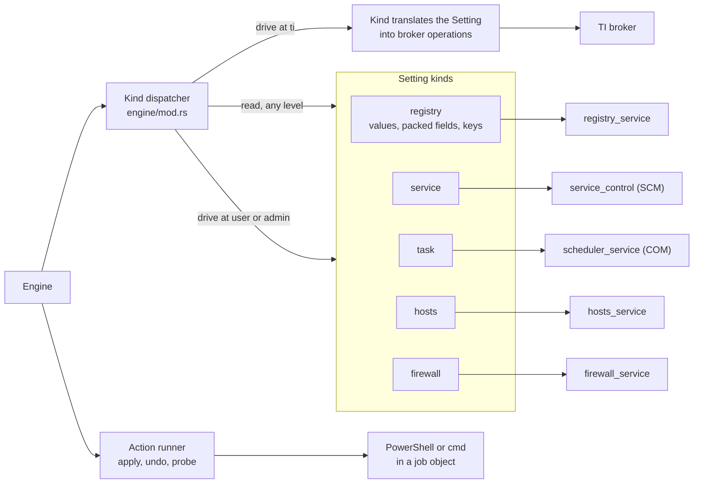

# Effect Kinds

An effect kind knows how to read and drive one kind of Windows setting. The engine decides *what* value an effect should have and *when* to change it; the kind knows *how*: which Windows API to call, how to tell "not there" from "not allowed", and how to express the change as an operation the elevated broker can run.

Code: `src-tauri/src/tweaks/kinds/` (one file per kind), on top of the low-level primitives in `src-tauri/src/services/`. Related decisions: ADR-0005 (levels), ADR-0006 (kind canonicalization).

[Back to the index](README.md)

## Shape of the layer

- Every Setting kind implements the same small interface: **read** a value and **drive** to a value. Registry, service and task also translate a Setting into broker operations, and the dispatcher batches a run of `ti` steps into one child.
- Reads always run in the app's own process. Drives run in-process at the `user` and `admin` levels, and through the [broker](elevation.md#the-trustedinstaller-broker) at `ti`.
- Revert and detection are not kind logic. Detection compares readings in the engine; revert is a drive back to a captured value. This keeps each kind small and makes read and drive the only two things a new kind must get right.
- Actions are not a Setting kind. The action runner runs `apply`, `undo` and `probe` scripts and is called by the engine directly.

## The kinds

| Kind | Read | Drive | Notes |
| --- | --- | --- | --- |
| Registry value | Detects the stored type, then reads it. A missing key or value reads `Absent`. A stored type different from the declared one is a type mismatch, not a value. | Writes the typed value, or deletes it (deleting something already gone succeeds). | Uses the registry API through the `winreg` crate (`services/registry_service.rs`). |
| Packed registry field | Parses a `key=value;` string and reads one field. An unparseable string is a malformed-value error. | Read, modify, write the whole string under a process-wide lock. | Not supported at `ti`. |
| Registry key | Whether the key exists. | Creates the key, or deletes the tree, but refuses when values exist beneath it. | Deletion guards reject a lone, leading or trailing backslash so a parent key is never deleted by accident. |
| Service | Existence from the Service Control Manager; the startup type from the service's `Start` registry value, and the delayed-start flag likewise, to tell Automatic from Automatic (Delayed). A service that does not exist reads `Missing`. | Checks the service exists, sets the startup type, and always rewrites the delayed-start flag. | At `ti` this becomes a startup-type op plus a registry op. |
| Task | Enabled state through Task Scheduler COM. A task that does not exist reads `Missing`; an unrecognized state is an error. | Checks the task exists, then enables or disables it. | COM calls are serialized process-wide. |
| Hosts entry | Whether the entry exists. | Adds or removes it; both are idempotent. | Edits go through an atomic file replace under a process-wide lock. No `ti` path. |
| Firewall rule | Whether the rule exists (COM). | Adds or deletes the rule. | Recreates only the fields the tweak authors. No `ti` path. |

### Missing resources

Only services and tasks can read `Missing`; a registry value reads `Absent`, and presence kinds read not-present. Driving a service or task to `Missing` does nothing (the other kinds reject it as invalid), and an elevated batch with no operations left never spawns a child. When the effect is not `optional`, a missing resource is a typed "resource missing" error, including on the elevated path, which repeats the existence check before building its operations.

## The action runner

- **Scripts**: PowerShell (passed as an encoded command) or cmd (written to an exclusive temporary file).
- **Containment**: every script runs in a job object that kills it if the app goes away. The default timeout is 30 seconds; an action's `apply` and `undo` can set 1 to 1800. Probes always use 30 seconds.
- **Results**: exit code 0 is success. Any other exit code is a typed action failure. A spawn failure or a timeout is an error, never a result.
- **Probes**: a probe script's exit code 0 means "present", anything else means "absent". A probe that cannot run is an error, not "absent".
- **Levels**: actions run at `user` or `admin`, never at `ti`. The validator rejects an action routed to `ti`, so scripts never reach the elevated broker.
- **App items** use the same runner for their presence probes, removals and winget installs, with their own exit-code rules and timeouts; see [apps.md](apps.md).

## The did-it-work contract

The kinds are where Windows results become typed answers, so this is where the contract is enforced:

- Errors keep "not found", "access denied", type mismatch, malformed value, resource missing, the three elevated outcomes (could not acquire, operation failed, outcome unknown) and the action failures (not started, non-zero exit, exit code unknown after a timeout or wait failure) apart. One exception is listed under [Traps](#traps).
- Mapping a Windows error never produces a `Missing` value. Only a successful "does not exist" answer does.
- A failed read of a service's delayed-start flag is an error, never "not delayed".
- Asking an action for an undo or probe it does not have is an error, never success.
- Every kind refuses to drive at `ti` in-process; that level only reaches Windows through the broker.

## Adding a kind

A new Setting kind needs:

1. a model variant and a value domain in `model.rs`, with a YAML spelling in `schema.rs`;
2. ownership keys in the validator so "one address, one owner" covers it, and a canonicalization rule if its state is also reachable as raw registry;
3. read and drive in a new `kinds/` module that keeps the error classes apart;
4. a broker operation if it must ever run at `ti`, or an explicit refusal at that level;
5. an entry in [TWEAK_AUTHORING.md](../../TWEAK_AUTHORING.md) and in this page.

## Traps

- **Hosts and firewall effects routed to `ti` fail at run time**, not at build time: the validator only stops actions at `ti`.
- **Inside the TrustedInstaller child, HKCU is the system account's hive.** That is why per-user registry effects always run in-process as the real user; see [elevation.md](elevation.md#levels-and-routing).
- **In a rollback, a batch that proves zero completed operations verifies none of them.** The items before the failing one are driven again, the failing one is recorded, and the rest are driven after it. A could-not-acquire failure re-drives nothing. A forward apply just fails and rolls back.
- **A service whose `Start` value cannot be read reports a generic error**, even when the cause is access denied, so detection shows Unknown without the "needs elevation" hint.
