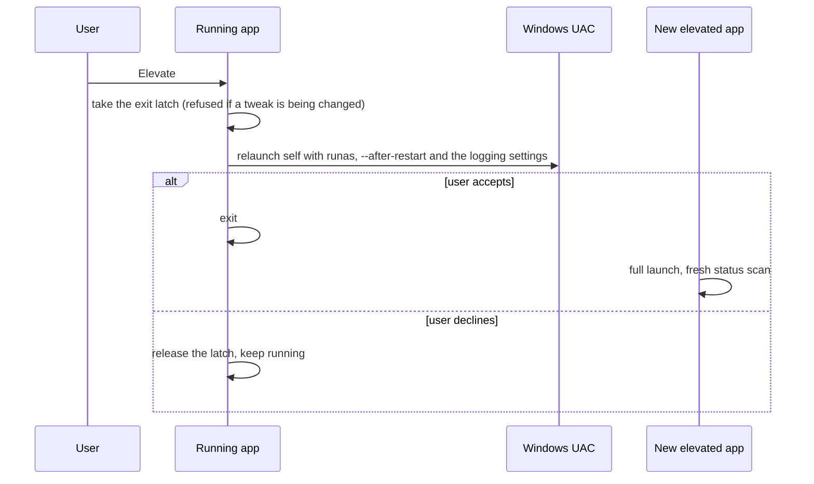
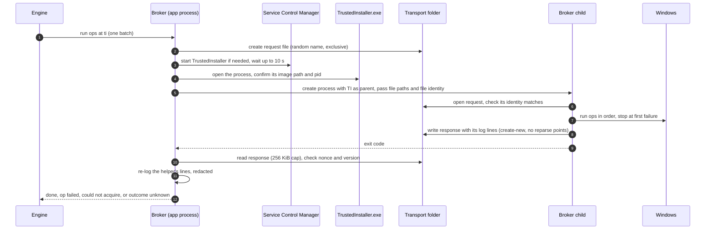

# Elevation

Elevation decides which privilege each step runs with, and supplies the one level the app process cannot hold itself: TrustedInstaller. Its rules are simple to state and strict to apply: the author declares the level, the app never raises it on its own, and a per-user setting always lands in the real user's hive.

Code: routing and the account guard in `src-tauri/src/tweaks/engine/context.rs`, the availability gate in `src-tauri/src/commands/tweaks.rs`, relaunch in `src-tauri/src/commands/elevation.rs`, and the broker in `src-tauri/src/services/elevation/` (`broker.rs`, `ti_elevation.rs`, `ti_probe.rs`, `common.rs`). Related decisions: ADR-0005, ADR-0010 (the helper's log lines).

[Back to the index](README.md)

## Levels and routing

There are three levels, ordered `user < admin < ti`.

- A tweak declares a **floor**. An effect may declare its own level, which can only raise it: the effective level is the higher of the two.
- **Per-user (HKCU) effects always run in-process as the interactive user**, whatever the floor. This includes shared settings and key deletions under HKCU. Inside a TrustedInstaller or elevated context, HKCU would be a different account's hive, so the change would land in the wrong place.
- **Reads** run at whatever level the app has right now and are never escalated. A TrustedInstaller-protected resource can deny a read to an Admin process; detection reports Unknown with an elevation hint.
- The app process itself is only ever `user` or `admin`. The `ti` level is reached only through the broker, and only for Settings: actions are never routed to `ti`.

| Level | Where a drive runs |
| --- | --- |
| `user` | In the app process. |
| `admin` | In the app process, which must already be elevated. |
| `ti` | In a short-lived child process started with TrustedInstaller as its parent. |

## Getting to Admin

The app ships unelevated. The user elevates on purpose with the Elevate button in the title bar:

The relaunch also passes the effective logging settings (`--log-persist=0|1`, `--log-detailed=0|1`), so an elevated instance running under another administrator account follows this user's choice for that session ([logging](../logging.md#settings)).

There is no Admin helper process: once the app is elevated, `admin` steps simply run in it.

## The availability gate

Before an apply or restore reaches the engine, the command layer checks, in order:

1. **Account guard** (tweaks that touch HKCU only). If the account running the app is not the owner of its session, a per-user change would land in the wrong hive. This happens when another administrator's credentials were typed into the UAC prompt. The check compares the process token's SID with the session owner's SID, falling back to account names; if they differ, or cannot be determined, the tweak is blocked. It is evaluated on every check, not once at startup, and applies to every tweak that touches HKCU at any level.
2. **Needs elevation**. The app is running as `user` and some step would need more. The required level includes the level a shared claim's release would restore at.
3. **Elevation path unavailable**. The tweak needs `ti` and the TrustedInstaller service is disabled or missing. This is known before the click: a one-time probe reads the service's startup type. A probe that cannot answer does not block.

A refusal reaches the UI as a reason ("Needs elevation", "Different account", "Account unknown", "Not available on this PC") and the controls are disabled. The app never elevates to get past it (ADR-0005).

## The TrustedInstaller broker

1. **Request.** The ops are wrapped with a wire version, a fresh nonce and the app's Detailed logging state (`detailed`) and written to an exclusive temporary file with a random name. The file lives in `%SystemRoot%\SystemTemp`, which only SYSTEM and Administrators can access, or in `%TEMP%` if that folder is missing or refuses the file (a refusal is logged; see [known issue 2](../../KNOWN_ISSUES.md)).
2. **Spawn.** The app enables `SeDebugPrivilege`, starts the TrustedInstaller service if it is not running, opens the TrustedInstaller process and confirms it is the real `TrustedInstaller.exe` that the service manager still reports. It then creates the child with TrustedInstaller as its parent process, hidden, passing the request and response paths plus the request file's identity (volume serial and file id).
3. **Child.** The app binary, started with `--broker`, opens the request and runs it only if the file's identity matches what it was given, so a substituted file is refused. It checks the wire version, runs the ops in order with the same effect services the app uses in-process, and stops at the first failure. It writes the response as a new file that must not already exist and must not be a reparse point. On a failure the response names the op's index, a failure class and, where the op has one, its numeric Windows error code (`win32`), never the error text, which can quote a key, a value or a path. The child logs that text at Debug only. The response also carries the child's own log lines (`log`, at most 200 of 512 bytes, at the level `detailed` asks for); the child never writes a log file. If it panics after reading the request, it writes a panic report (its log lines and the panic message, with the version and nonce) to the response path and exits with the panic code.
4. **Wait.** The app waits up to 30 seconds. On a timeout it terminates the child and waits up to 5 more seconds to confirm it is gone (logging an error if it cannot); either way the outcome is unknown.
5. **Classify.**

   | Outcome | Meaning | Engine treats it as |
   | --- | --- | --- |
   | Done | Every op ran. | Success, then verified by read-back. |
   | Op failed | The child names the failing op, its class and its Windows error code where it has one. | A failed step, rolled back normally. |
   | Could not acquire | Nothing ran: TrustedInstaller could not be started or opened, the child could not be created, or it refused the request. | A failure where nothing changed. |
   | Outcome unknown | Timeout, a crash or panic, an unreadable, oversized (over 256 KiB) or inconsistent response, a nonce or version mismatch. | A failure whose effect is uncertain: the snapshot entry is kept and the tweak needs attention. |

The operations the child can run are fixed and typed: set, delete or create registry values and keys, set a service's startup type, and enable or disable a scheduled task. There is no script operation; scripts never run at `ti`.

Two or more adjacent `ti` Settings in one tweak are sent in a single batch, so each run of adjacent `ti` Settings spawns one child rather than one per effect. A lone `ti` Setting, a `ti` shared claim or release, and each rollback drive-back run spawn their own child. None of this adds UAC prompts: the app is already elevated before any `ti` step can run.

## Traps

- **The child inherits the app's environment but not its HKCU.** Its HKCU is the system account's hive, which is why per-user effects never go to the broker.
- **The wire version exists because the app and the child can be different builds** right after an update.
- **TrustedInstaller is only reachable from an Admin process**, because opening it needs `SeDebugPrivilege`.
- **The child's log lines come back only in a file it writes** ([known issue 3](../../KNOWN_ISSUES.md)). The app re-logs them under the `helper` source, tagged `#n` with the batch number, only after the response, or a panic report, passes the version and nonce checks. A child that is killed (an antivirus kill, the 30 second timeout) or cannot write its response leaves only the app's exit-code line ([logging](../logging.md#the-trustedinstaller-helper)).
- **The binary is unsigned.** Parent-process spoofing from an unsigned binary looks like malware to behavioural detection; see [TEST_MATRIX.md](../../TEST_MATRIX.md) for the signing plan.
