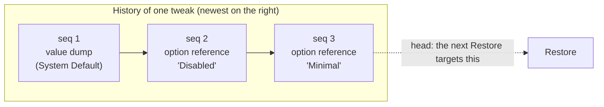
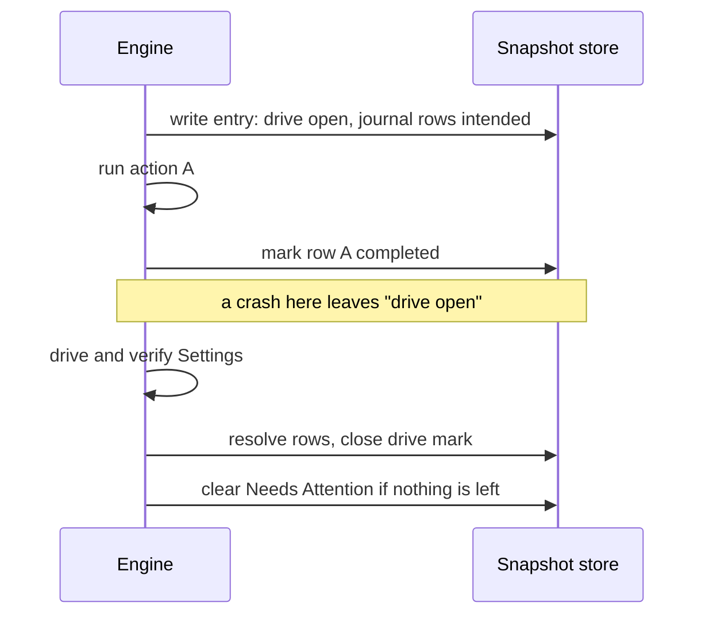
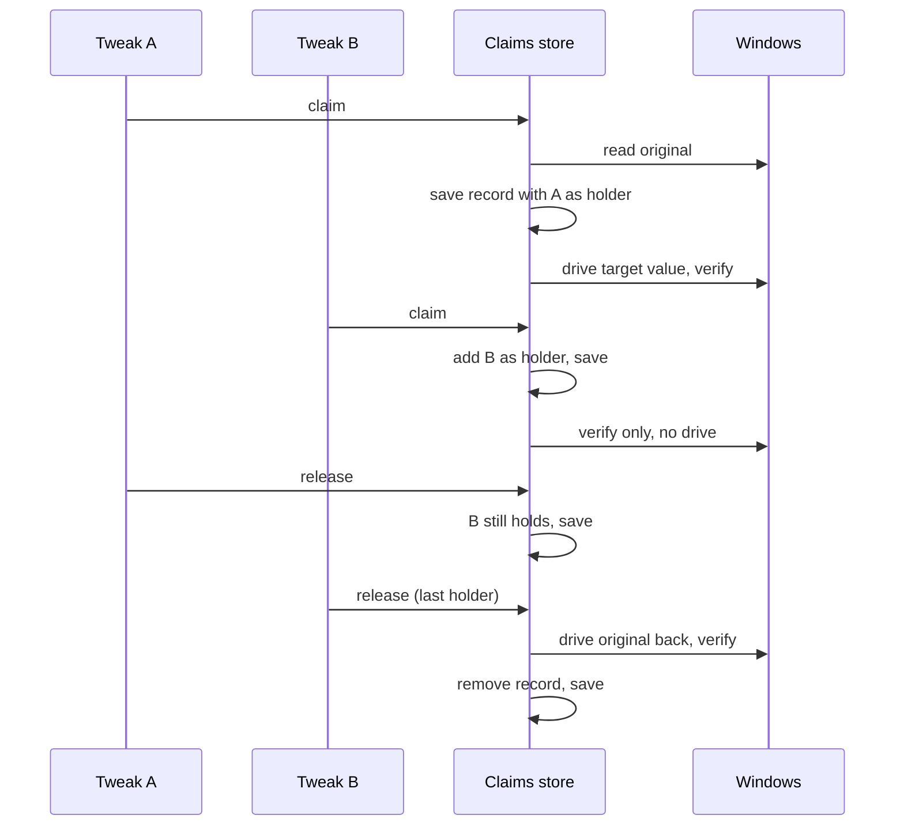

# Persistence: Snapshots, Needs Attention and Shared Claims

Persistence is what makes a change reversible and a failure visible after the app closes. The snapshot store keeps each tweak's history of return points, the Needs Attention record, and the marks that expose unfinished work after a crash. The claims store reference-counts settings that several tweaks share. Both are plain storage: the engine decides what to write, and the stores make every write atomic and refuse to touch data that is not theirs.

Code: `src-tauri/src/tweaks/snapshot.rs`, `src-tauri/src/tweaks/shared_claims.rs`, and the crash scan in `engine/lifecycle.rs`. Related decisions: ADR-0001, ADR-0002, ADR-0006, ADR-0007, ADR-0008.

[Back to the index](README.md)

## On-disk layout

Everything lives in a portable `snapshots/` folder next to the executable, so the history travels with the app.

```text
snapshots/
├── shared_claims.<MachineGuid>.json      shared claims for this machine
└── <tweak-id>/
    ├── 00000000000000000001.json         snapshot entry, seq 1
    ├── 00000000000000000002.json         snapshot entry, seq 2 (the newest)
    ├── _seq.json                         highest seq issued so far (a hint)
    ├── _attention.json                   Needs Attention record (machine-wide tweak)
    └── _attention.<SID>.json             Needs Attention record, one per account (tweak that touches HKCU)
```

- **Atomic writes**: every file is written to a temporary file in the same folder, flushed, then renamed over the target with write-through. A new entry never overwrites an existing file; a seq collision is an error.
- **Stamps**: entries carry a schema version, the machine's `MachineGuid` and the capturing account's SID. Attention records carry the schema version and machine guid; their account is encoded in the file name only. The claims file carries its schema version and machine guid.
- **One file per machine for claims**, so a portable folder used on two PCs never mixes one machine's originals with another's. If the `MachineGuid` cannot be read, the file is the unsuffixed `shared_claims.json`.

## Snapshot history



- **Ordering** is a per-tweak sequence number that only grows. Wall-clock time is stored for display only.
- **Head** is the highest-numbered entry that is valid. Restore always targets the head.
- **What an entry holds**: an **option reference** (just the label, re-applied from the current corpus on restore, ADR-0007) when the tweak was at an authored option, or a **value dump** (every captured value) when it was at System Default or had drifted. Shared effects appear in neither; their way back is the claims store.
- **Deduplication**: pushing a reference to an option removes an older entry with the same label, but only when that older entry is valid and fully settled. The new entry is written first. Value dumps are never deduplicated, because each one records a unique machine state.

### Valid and invalid entries

An entry that cannot be trusted is **invalid**: kept on disk, skipped by Restore, listed in the details window with its reason, and removed only by the user.

| Reason | Meaning |
| --- | --- |
| Corrupt | Cannot be parsed, or has no schema version. |
| Wrong schema | Written by a different schema version (ADR-0008). |
| Wrong machine | Stamped with a different `MachineGuid` (only when both are known). |
| Wrong user | Captured by another Windows account, for a tweak that touches HKCU. |
| Dangling reference | The tweak or the referenced option no longer exists in the corpus. |
| Target unavailable | The referenced option does not apply to this Windows build. |

### Who may delete an entry

Only three paths delete entries (ADR-0002):

1. **Consume**: a verified restore, or a verified rollback of the entry the apply just wrote. Consume refuses to delete an entry that still carries an unsettled mark; the entry stays as evidence.
2. **Deduplication** of a valid, settled entry for the same option.
3. **Discard**: the user's explicit decision, through "discard entry" or "keep current state". A single discard refuses another account's entry.

Nothing deletes an entry on a failure path, and there is no automatic clean-up at startup.

## Needs Attention

**The mental model.** Each tweak can carry one sticky note that says "the machine may not be what the app thinks". Failures write it. Only two things remove it: a fully verified apply or restore that leaves nothing unresolved, or the user choosing to keep the current state. Separately, each entry carries pencil marks written *before* each piece of work starts, and erased when that work is proven finished or once its failure is written into the sticky note, which then names it. On the next launch, any mark still standing becomes a sticky note.

The note is a file of its own rather than a field on an entry, because deduplication, consume and entries turning invalid all remove entries, and the note has to outlive every one of them.

### The record

A record has a **reason** and a list of **items**.

| Reason | Written when |
| --- | --- |
| `apply_failed` | An apply's rollback could not be verified, or an elevated step's outcome is unknown. |
| `restore_failed` | A restore did not fully verify. |
| `crash_residue` | The startup scan found marks left by an interrupted operation. |
| `outcome_unrecorded` | An operation verified, but settling its marks on disk failed. |
| `record_unreadable` | Never written: reported when a record exists but cannot be read or belongs to someone else. |

Each item names the effect (when there is one), a **kind** (`drive`, `verify`, `outcome_unknown`, `action`, `no_undo`, `claim`, `store`, `crash_residue`, `unrecorded`, `other`), an optional failure **class** (access denied, not found, invalid data, busy, failed), the entries it explains, and a message. The kind lets the UI tell a retryable step from a one-way one.

A new failure merges into this build's existing record rather than replacing it, so an earlier problem is not hidden by a later one. An unparseable record is replaced, and writing over a foreign record fails.

### Ownership

- A record stamped by another machine, or by a newer schema, belongs to someone else: it is shown as unreadable, never written over, and removed only by the user's "keep current state".
- A record from an older schema, or with no owner stamp, belongs to this build and can be replaced.
- An unparseable record is shown as unreadable, never treated as "nothing to attend to".

### The durable marks

| Mark | Set | Cleared |
| --- | --- | --- |
| **Drive open** | On the entry an apply or restore drives from, before its first Setting or Shared change. | When the operation verifies, when its rollback verifies, when the operation's failure is recorded in Needs Attention, or by the user's consent. |
| **Actions in flight** | Before a rollback or restore undoes or re-runs an action. | When that action finishes and verifies, when it is later driven or probed by another verified operation, when the operation's failure is recorded, or by consent. |
| **Journal rows** | One per planned action, written with the entry before anything runs. A row is outstanding while it is intended, not completed and not resolved. | `completed` once the action has run. `resolved` by an operation that drove, verified or probed that exact action; by a verified rollback, for the rows of its own entry that the apply never ran; or by consent. |
| **Outcome unrecorded** | When an operation verified but could not rewrite its marks (for example, the entry file was held open elsewhere). The item names the entries whose marks it explains, so the scan does not report them twice. | It is an item in the Needs Attention record, so it goes when the record is cleared. |

A verified apply or restore resolves the rows it accounted for **before** it clears the record. A crash between the two therefore leaves at worst a stale record that the next clear releases, never a resolved tweak that the next scan marks again.



## Startup crash scan

The scan runs synchronously during app setup, before the frontend asks for anything.

1. For each tweak in the corpus, it reads the entries that belong to this schema, this machine and (for tweaks that touch HKCU) this account.
2. It collects one `crash_residue` item for the open drive marks, one per action still in flight, and one per outstanding journal row. Drive marks already explained by an `unrecorded` item are skipped.
3. It adds those items to the tweak's record (creating a `crash_residue` record, or merging into this build's existing record). It never writes over a foreign or unreadable record.
4. Needs Attention records for tweaks the corpus no longer defines are logged by tweak id. Nothing is deleted, and those folders are not scanned.

## Shared claims

Some settings are genuinely needed by several tweaks with the same value, such as Defender's attack surface reduction master switch, which four ASR tweaks need on. Instead of letting them fight over one address (which "one address, one owner" forbids), the corpus declares a **shared setting** and each tweak **claims** it (ADR-0006).



- **Record**: for each shared setting, the setting, the captured original, the holders, and a `restore_level`.
- **First claim** reads the original and saves the record, with its holder, *before* driving. A rollback can therefore release every claim its apply added, even one whose drive failed.
- **Later claims** only add a holder and verify the live value.
- **The last release** drives the original back, unconditionally and verified, and only then removes the record. External drift is overwritten by that return. A failed restore saves nothing.
- **`restore_level`** is the highest level any holder routed at. The final restore runs at the higher of it and the releasing tweak's level, so a value captured at TrustedInstaller level is never driven back at Admin.
- **Versions**: version 2 is current. A version 1 file loads, falls back to the releasing tweak's level (and logs it), and is rewritten as version 2 on the next save. Any other version, a file stamped for another machine, or an unreadable file is corrupt: never rewritten and never read as "no claims". Detection then reports Unknown, and apply and restore fail.
- An older, unsuffixed `shared_claims.json` stamped for this machine is read until the first write folds it into the per-machine file; one stamped for another machine is ignored.
- All claims operations take one process-wide lock.

## Traps

- **Two schema rules.** An older-schema attention record is replaceable; an older-schema entry is invalid and untouchable. Both are deliberate.
- **The attention record has no SID inside it.** Per-account separation relies on the file name, and reads check both names so a record under the other name still surfaces.
- **The availability gate reads claims through its own claims store instance** (re-read on each check) and treats an unreadable claims file as "no extra level needed". The apply itself still fails correctly on a corrupt file.
- **A failed dedup removal leaves a duplicate**, logged as a warning. The history then holds two references to the same option.
- **A crash between writing a temporary file and renaming it leaves a `.tmp` file** in the tweak folder. It is ignored because its name is not a sequence number.
